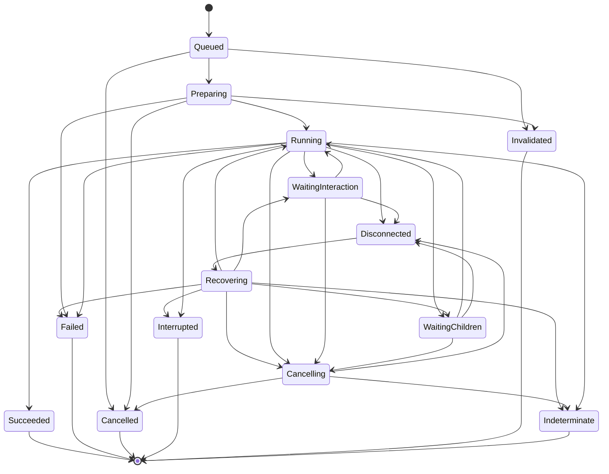

# Provider Execution and Agent Lifecycle Architecture

Status: architecture decision complete; the implementation plan is ready and code migration has not started.

Scope:

- Current Grimoire provider, execution, tab, and agent behavior at commit `710a43cf`.
- A target architecture for the next several years of provider and agent development.
- A staged transition that preserves provider-native behavior while replacing lifecycle ownership.
- No production behavior changes in this research phase.

The executable migration sequence, checkpoints, deletion gates, and provider waves are defined in
[`provider-execution-migration-plan.md`](provider-execution-migration-plan.md).

## Decision

Grimoire should adopt a lifecycle-centered execution platform as its target architecture.

The long-term ownership model should be:

`ExecutionBackend -> ExecutionSession -> ExecutionRun`

with a first-class agent domain beside it:

`AgentDefinition -> AgentInstance -> AgentRun`

and a durable `WorkGraph` for dependencies, parent-child relationships, result provenance, and synthesis.

`ChatRuntime` must not remain a compatibility boundary inside the new lifecycle core. The transition is large in architectural scope but incremental inside this branch: new backends, repositories, coordinators, and projections are built and verified alongside the existing application path, then the composition root switches once and the old runtime architecture is deleted before the branch is ready to merge.

The platform should normalize identity, ownership, state transitions, cancellation, recovery, result delivery, and UI-safe projections. It must not normalize provider protocols, transcript formats, process topology, security guarantees, or native features that are genuinely different.

Lifecycle guarantees are platform-independent. macOS and Linux may use POSIX process groups while Windows uses process-tree supervision, but every supported desktop platform must retain ownership through startup, cancellation, root-process exit, and application unload, and must classify unconfirmed cleanup as indeterminate.

This decision is driven primarily by lifecycle correctness and feature cost, not API aesthetics. Correct background agents, restart recovery, concurrent work, structured results, targeted cancellation, provider settings transitions, and reusable auxiliary runs all need ownership that outlives a tab and is narrower than the whole plugin.

## Why the current center will not scale

### One runtime contract owns several unrelated lifetimes

[`ChatRuntime`](../src/core/runtime/ChatRuntime.ts#L20-L67) currently combines:

- provider and process readiness;
- provider-native session state;
- one requested turn and its stream;
- cancellation and steering;
- approvals, questions, plan exit, and auto turns;
- commands, MCP reload, rewind, and fork helpers;
- conversation persistence updates;
- subagent hooks and result loading;
- cleanup.

These operations do not share one natural owner or lifetime. A provider process may serve several logical sessions, a logical session may survive process recycling, an agent may outlive its parent turn, and a title or inline-edit run must not mutate the chat session that happened to create it.

Adding more optional methods to this interface would preserve the ambiguity. Providers with weaker capabilities would continue to implement no-op behavior, while providers with stronger native features would leak special cases through shared code.

### The feature layer currently completes the turn

[`InputController`](../src/features/chat/controllers/InputController.ts#L389-L735) owns the active-stream flags and generation fence, creates provisional messages, waits for provider readiness, iterates the runtime stream, interprets cancellation and invalidation, consumes late metadata, finalizes message blocks, handles plan approval, saves the conversation, and releases queued input.

[`StreamController`](../src/features/chat/controllers/StreamController.ts) then converts provider chunks into message state, tool state, subagent state, and DOM updates. The UI is therefore both a lifecycle coordinator and a projection. A detached or rebuilt view cannot reliably recover the same execution state without reconstructing it from UI-owned objects.

The neutral [`StreamChunk`](../src/core/types/chat.ts#L213-L251) carries content plus broad `error` and `done` variants, but no Grimoire session, run, turn, sequence, cancellation acknowledgement, or typed terminal result. Generator completion therefore becomes an implicit lifecycle signal even when the provider never produced a visible result.

The controller also creates local user and assistant messages before first-use runtime initialization. An initialization failure can consequently leave provisional message and pending-save state that never corresponded to a provider run ([message creation and initialization](../src/features/chat/controllers/InputController.ts#L470-L523)). A lifecycle coordinator should accept the run before publishing durable turn state, or record a typed preflight failure against that same run.

### Agent lifetime is tied to tab lifetime

The current [`SubagentManager`](../src/features/chat/services/SubagentManager.ts#L62-L87) stores logical subagent maps alongside DOM state and provider-result parsing. On tab teardown, active work is marked orphaned, all maps are cleared, and the runtime is cleaned up ([tab teardown](../src/features/chat/tabs/Tab.ts#L1728-L1738)). The orphan transition itself turns a running agent into an error with a UI string ([subagent lifecycle](../src/features/chat/services/SubagentManager.ts#L535-L575)).

That is a tab lifecycle, not an agent lifecycle. Closing a view is neither proof that provider work stopped nor a user request to cancel it.

The current agent types are also presentation-oriented. [`AgentDefinition`](../src/core/types/agent.ts#L1-L16) describes reusable configuration, while [`SubagentInfo`](../src/core/types/tools.ts#L56-L79) mixes display expansion, tool calls, runtime status, result text, and provider IDs. There is no durable identity for an agent instance or a retry attempt.

The optional [`ProviderSubagentLifecycleAdapter`](../src/core/providers/types.ts#L538-L553) recognizes provider tool names and parses spawn/wait strings into that display model. It is currently registered only by Codex and Grok. This is a useful compatibility normalizer, but it is not an execution, cancellation, recovery, interaction, or result contract.

### Parallel workers are tabs, not a work model

The current orchestrator prompt emits only independent tasks ([orchestrator instructions](../src/core/prompt/mainAgent.ts#L118-L146)). After approval, the view creates background tabs and fire-and-forgets one message into each tab ([worker launch](../src/features/chat/GrimoireView.ts#L859-L879)). Live tab objects retain the parent and child tab IDs, but normal persisted tab state does not ([tab state](../src/features/chat/tabs/types.ts#L268-L307)).

This is useful UI automation, but it cannot represent:

- dependencies between tasks;
- retry attempts;
- durable progress or partial results;
- restart and reattachment;
- parent-child cancellation policy;
- result provenance;
- a synthesis step that references exact worker results;
- one worker failing while the other results remain available.

### Resource ownership is incomplete

Warm runtime eviction currently protects the active tab and streaming tabs, then calls runtime cleanup directly ([warm runtime eviction](../src/features/chat/tabs/TabManager.ts#L1288-L1313)). It cannot express an open interaction, a detached agent, a pending persistence barrier, an auxiliary run, or a provider settings transition.

All provider workspaces are also initialized sequentially on plugin load ([workspace initialization](../src/core/providers/ProviderWorkspaceRegistry.ts#L44-L58), [startup call](../src/main.ts#L100-L104)). Workspace services expose initialization but no matching asynchronous disposal contract. Lifecycle and failure isolation therefore vary across providers and callers.

The feature layer also contains a second execution path outside provider runtimes. [`BangBashService`](../src/features/chat/services/BangBashService.ts) starts a local side-effecting process, and [`Tab`](../src/features/chat/tabs/Tab.ts#L472) owns that service directly. It has no durable run identity, recovery state, or application-scoped cancellation owner. A provider-only lifecycle would therefore leave an existing executor behind. The shared execution identity must be a generic backend identity, with provider association as one backend kind and local shell execution as an internal kind.

Provider registration also has fragmented ownership. Runtime and workspace entries are paired manually in [`src/providers/index.ts`](../src/providers/index.ts#L22-L50), while default settings are assembled separately in [`src/providers/defaultProviderConfigs.ts`](../src/providers/defaultProviderConfigs.ts#L1-L23). There is no single atomic definition or parity invariant for all provider contributions.

### Conversation persistence cannot support multiple lifecycle owners

Conversation save currently asks the active runtime to build provider updates and then persists a shared conversation object without a durable revision or serialized mutation contract ([conversation save](../src/features/chat/controllers/ConversationController.ts#L443-L475)). The tab manager explicitly prevents the same conversation from being mounted twice because the two views could overwrite one another ([duplicate binding guard](../src/features/chat/tabs/TabManager.ts#L700-L715)).

Background agent completion, title generation, history hydration, multiple views, rewind, and settings reconciliation all need to update related state without a last-writer-wins race. A lifecycle platform that leaves conversation persistence mutable and unversioned would move the race rather than solve it.

Provider history hydration is also a side-effect-only contract, so callers cannot distinguish absent, partial, corrupt, stale, and recovered history states ([history service contract](../src/core/providers/types.ts#L481-L496)). Recovery must become observable without replacing the provider-native transcript as the source of truth.

## Options considered

| Option | Near-term cost | Long-term feature cost | Agent lifecycle | Provider fidelity | Decision |
| --- | --- | --- | --- | --- | --- |
| Continue expanding `ChatRuntime` | Low | High and increasing | Remains tab/stream-centered | Special cases accumulate | Reject |
| Add execution sessions but leave agents in UI state | Medium | Medium to high | Restart, ownership, and results remain unresolved | Better execution correlation only | Reject |
| Adopt execution lifecycle plus first-class agents and projections | High | Lowest sustainable cost | Durable and explicit | Preserved behind adapters and capability ports | Adopt |
| Switch production providers one by one behind long-lived flags | High | High while both systems remain | Split authority during transition | Parity becomes difficult to prove | Reject |

The selected target is the third option. The selected delivery strategy is staged construction and verification followed by one composition-root cutover. It is not a provider-by-provider production rollout and not a permanent dual architecture.

## Target architecture

```mermaid
flowchart TB
    catalog["Validated provider catalog"] --> module["Provider module"]
    module --> backend["Execution backend"]
    internal["Internal execution services"] --> backend
    backend --> session["Execution session"]
    session --> run["Execution run"]

    lifecycle["Lifecycle registry<br/>generations and leases"] --> backend
    lifecycle --> session
    lifecycle --> run

    graph["Work graph"] --> instance["Agent instance"]
    instance --> agentRun["Agent run"]
    agentRun --> run

    run --> events["Scoped execution events"]
    agentRun --> results["Durable agent results"]
    events --> reducers["Idempotent reducers"]
    results --> reducers
    reducers --> projections["Chat and agent projections"]
    projections --> views["Tabs, panels, and history views"]
```

The architecture has four primary layers and three cross-cutting concerns.

1. The provider control plane defines providers, settings, workspace services, capabilities, and backend creation.
2. The execution plane owns backend, session, run, interaction, and terminal-outcome lifecycles.
3. The work and agent plane owns definitions, instances, attempts, dependencies, cancellation policy, results, and synthesis.
4. The projection plane reduces lifecycle events into UI state. Tabs render and control projections but do not own the underlying work.
5. A lifecycle registry owns leases, backend generations, quiescence, and disposal across all layers.
6. Revisioned conversation persistence serializes durable mutations without replacing provider-native transcripts.
7. A small durable control store supports restart and reattachment without turning the UI into an event database.

## 1. Provider control plane

### One validated provider module

Each built-in provider should contribute one atomic definition:

```ts
interface ProviderModule {
  manifest: ProviderManifest;
  settings: ProviderSettingsCodec;
  workspace: ProviderWorkspaceContribution;
  execution: ExecutionBackendFactory;
  capabilities: ProviderCapabilityDescriptor;
  features: ProviderFeatureContributions;
}
```

The catalog validates before publishing any projection:

- unique provider ID and deterministic ordering;
- matching capability and manifest identities;
- default settings and a persisted-settings codec;
- execution backend factory;
- workspace initialization and disposal ownership;
- explicit feature and security declarations.

The existing runtime and workspace registries remain part of the unchanged production path while the new catalog is tested separately. The hard cutover replaces them once; they are not rebuilt as adapters over the new catalog and do not survive as separately maintained inventories.

This is a compile-time catalog for built-in providers. It is not a public third-party plugin ABI and should not take on compatibility promises that Grimoire does not need yet.

### Provider-owned settings codecs

Persisted provider configuration is untrusted input. Each provider codec should decode every field, choose explicit fallbacks, preserve unknown provider-owned keys on round trip, and fail closed for permission, sandbox, approval, and tool modes.

Runtime-affecting inputs should use a versioned canonical SHA-256 fingerprint as a change detector. Current concatenated environment values must not continue to be stored under a field named as a hash. Legacy values should be rewritten once with conservative session invalidation because the old encoding is lossy.

A digest is a data-minimization measure, not a secret store. Canonical inputs, digest preimages, secrets, and environment values must never be written to lifecycle events or diagnostics.

### Lazy, isolated workspace lifecycle

Provider workspace initialization should use explicit states:

`uninitialized -> initializing -> ready | failed -> retry`

and terminal disposal:

`ready | failed -> disposing -> disposed`

Concurrent first use shares one promise. Each attempt receives an abort signal and generation token. A completed stale attempt cannot publish services after disposal or a settings transition. One provider failure cannot block plugin startup or another provider.

Only the active provider may be prewarmed after the view becomes usable. Every first-use caller must support loading, failure, and retry rather than assuming startup initialized all providers.

### Feature ports instead of a larger runtime

The execution session should not absorb every provider capability. Native features remain narrow ports such as:

- history and transcript access;
- model discovery and selection;
- commands and workspace resources;
- steering;
- rewind, fork, and compaction;
- MCP management;
- native agent control;
- usage and quota;
- security and permission enforcement.

Unsupported capabilities are absent or explicitly reported. They are not provider-local no-op implementations.

## 2. Execution plane

### Backend, session, and run contracts

The conceptual contracts are:

```ts
interface ExecutionBackendDescriptor {
  backendId: ExecutionBackendId;
  association:
    | { kind: 'provider'; providerId: ProviderId }
    | { kind: 'internal'; service: InternalExecutionServiceId };
}

interface ExecutionBackend {
  readonly descriptor: ExecutionBackendDescriptor;
  createSession(config: ExecutionSessionConfig): Promise<ExecutionSession>;
  dispose(): Promise<void>;
}

interface ExecutionSession {
  readonly executionSessionId: ExecutionSessionId;
  readonly sessionInstanceId: SessionInstanceId;
  createRun(request: ExecutionRequest): ExecutionRun;
  getSnapshot(): ExecutionSessionSnapshot;
  subscribe(listener: ExecutionIngressEventListener): Unsubscribe;
  dispose(): Promise<void>;
}

interface ExecutionRun {
  readonly runId: RunId;
  readonly events: AsyncIterable<ExecutionIngressEvent>;
  cancel(reason?: CancellationReason): Promise<void>;
}
```

These contracts describe logical ownership, not process topology.

- A Codex backend may share an app-server across sessions.
- A persistent SDK provider may retain a query/session object.
- An ACP provider may own a subprocess and protocol connection.
- A stateless provider may launch one process per run.

Core code must not require one process per backend or one process per session. Provider adapters retain process, transport, reconnect, auth, and protocol responsibilities. Provider association is immutable backend metadata, not the identity of execution itself. `InternalExecutionServiceId` is a branded identifier validated by application composition, not a closed capability enum. This also brings Grimoire-owned executors such as local shell commands under the same cancellation, terminal-outcome, unload, and projection rules without pretending that they are providers.

### Explicit owners

Every session and run has a durable product owner independent of the current view:

- conversation;
- agent instance;
- orchestration/work graph;
- auxiliary operation such as title, refine, or inline edit;
- workspace probe or warm-up.

A tab receives an attachment to an owner projection. It is never the owner ID itself.

Auxiliary operations use isolated ephemeral sessions or runs. Their output, cancellation, and provider state cannot leak into the visible conversation merely because the same provider backend served both.

### Identity and event correlation

Every normalized provider event accepted into the core journal receives an immutable envelope:

```ts
interface ExecutionEventEnvelopeBase {
  schemaVersion: number;
  backendId: ExecutionBackendId;
  backendGeneration: number;
  executionSessionId: ExecutionSessionId;
  sessionInstanceId: SessionInstanceId;
  eventId: string;
  sequence: number;
  occurredAt: number;
}

type ExecutionEventEnvelope = ExecutionEventEnvelopeBase & {
  scope:
    | { kind: 'session' }
    | { kind: 'run'; runId: RunId; turnId?: TurnId }
    | {
        kind: 'agent';
        runId: RunId;
        agentInstanceId: AgentInstanceId;
        agentRunId: AgentRunId;
      };
  event: ExecutionEvent;
};
```

Agent events additionally carry `agentInstanceId` and `agentRunId`. Provider-native session, thread, turn, task, and agent IDs remain opaque references owned by the adapter.

`executionSessionId` is Grimoire's durable logical session identity. `sessionInstanceId` identifies one live incarnation; process recycling may retain the incarnation, while restart or reattachment creates a new one linked to the same logical session. Neither value is a provider-native resumable session ID. `backendGeneration` fences every event emitted before a settings transition or internal-backend replacement, and the instance ID rejects a late emitter from an older incarnation. `runId` targets cancellation and result ownership. Provider identity, when present, is resolved from the immutable backend descriptor rather than duplicated in every event.

One logical-session ingestor is the sequencing authority for both backend run streams and the session subscription. It deduplicates by `(backendGeneration, executionSessionId, eventId)` and then assigns the next Grimoire `sequence` for that logical session. An adapter ingress event must supply a stable delivery key derived from a native event ID, cursor, or stable native scope and ordinal when one exists; the ingestor uses that key as `eventId`. A new random ID on redelivery is not sufficient. A backend without stable replay identity must reconcile from status or snapshot after reconnect instead of replaying raw events as if they were deduplicable.

If a provider exposes causal ordering, its adapter buffers a bounded out-of-order window before ingestion. A missing predecessor that does not arrive triggers a typed gap diagnostic and provider snapshot/status reconciliation. The reducer does not silently skip the gap or apply a terminal event across it. If reconciliation cannot establish a safe state, the affected run enters recovery and may eventually become `indeterminate`.

Delivery inside the plugin may therefore be at least once. Reducers reject duplicate, stale-generation, wrong-session, and ordinary post-terminal events. Correctness does not rely on a single consumer observing a perfect stream exactly once.

Requested-run events are available on the run stream. Session subscription carries background and session-scoped events that may arrive after the initiating run ends. The registry is the sole subscriber that converts both sources into durable lifecycle facts and projections; views subscribe to projections rather than consuming provider streams directly.

### Run state and terminal outcomes



The diagram shows the common paths. A connection or adapter loss first enters nonterminal `disconnected` and `recovering`. It does not finish the run while the backend still has a supported status-query, reattach, or checkpoint recovery path. Cancellation intent is a durable orthogonal flag, so recovery from `cancelling` continues cancellation rather than silently returning to normal execution. Active or waiting states may reach `failed`, `interrupted`, or `indeterminate` when recovery establishes the corresponding fact. `cancelled` is used only after cancellation is confirmed; a lost cancellation acknowledgement becomes `indeterminate` when external effects may still continue.

Every requested run records exactly one terminal outcome:

- `succeeded`: the declared result contract was satisfied;
- `failed`: the provider or Grimoire produced a known failure;
- `cancelled`: cancellation was acknowledged and the run stopped;
- `interrupted`: execution stopped before completion and no unsafe uncertainty remains;
- `invalidated`: the run was rejected before provider dispatch, or the provider confirmed rejection before any side effect;
- `indeterminate`: the transport or host disappeared after external side effects may have occurred and completion cannot be proven.

An async iterator ending is not a successful terminal outcome. Without a native terminal fact, it enters the same disconnect/recovery policy. The registry records a terminal only when provider status, a declared conclusive process exit, exhausted recovery, or shutdown reconciliation establishes one.

Runs declare whether a user-visible result is `required`, `optional`, or `none`. A chat or agent run marked `required` cannot become `succeeded` merely because thinking or tool activity occurred. It needs an explicit final result event. This separates “the provider stopped” from “the user received a result.”

An `indeterminate` side-effecting run is never retried automatically. The UI must explain that completion is unknown and let the user inspect native history or choose a deliberate retry. The original terminal remains immutable. If later native history proves what happened, the registry may attach a separate `ReconciliationRecord` with the observed result and provenance; it does not replace the terminal or replay ordinary late events.

```ts
interface ReconciliationRecord {
  runId: RunId;
  originalTerminal: 'indeterminate';
  observedOutcome: 'succeeded' | 'failed' | 'cancelled' | 'interrupted';
  observedResult?: ResultRef;
  evidence: ReconciliationEvidence;
  recordedAt: number;
}
```

Reconciliation is append-only evidence. It may make a recovered result available to a later explicit synthesis attempt, but it does not pretend that the original Grimoire run completed normally or authorize an automatic retry.

### Interactions

Approvals, questions, and plan decisions are run-scoped interactions, not callbacks installed on a long-lived runtime. An `InteractionPort` carries:

- stable interaction ID and owning run;
- typed prompt and allowed responses;
- requested permission or capability delta;
- expiry/cancellation state;
- one idempotent resolution.

An interaction remains visible after a tab detaches and may be answered from any projection of the same owner. Resolving it after the run terminal is rejected.

## 3. First-class agents and work graphs

### Separate definition, instance, and attempt

`AgentDefinition` remains reusable configuration: prompt, tools, skills, model preference, hooks, and permission policy. Starting an agent captures a definition revision or digest so later file edits cannot silently change a running instance.

`AgentInstance` is a durable logical participant:

- stable instance ID;
- definition snapshot or revision reference;
- provider and execution mode: `provider-native` or `grimoire-managed`;
- root owner and at most one parent agent instance;
- opaque native agent identity when available;
- attachment policy: `attached` or `detached`;
- accumulated result and lifecycle references.

`AgentRun` is one attempt:

- stable agent-run ID;
- linked execution session and run IDs;
- goal and policy snapshot;
- status and progress checkpoints;
- pending interactions;
- partial and final result references;
- start, update, and terminal timestamps;
- terminal reason.

Retry always creates a new `AgentRun`. It never rewrites the failed, cancelled, or indeterminate attempt.

Grimoire-requested agent dispatch is a durable two-step transition:

1. Persist the new attempt, effective policy, stable dispatch token, and `dispatching` state before calling the provider.
2. Persist the accepted native identity or explicit rejection before marking the attempt `running`.

The adapter uses the dispatch token as an idempotency key only when the provider has a real idempotent launch contract. After a crash between provider acceptance and native-identity persistence, recovery first queries or adopts the native run through provider-supported correlation. If acceptance cannot be proven, the attempt becomes `indeterminate` with reason `dispatch_unknown`, and automatic relaunch is blocked. A retry is a visible new attempt because silently launching twice is worse than requiring a decision.

A provider may also spawn a native child inside an already-running parent without a prior Grimoire dispatch call. That child is adopted idempotently from a stable native identity and records `observed-native` origin; the platform does not invent a pre-dispatch intent after the fact. Restart recovery uses provider status, history, or sidecar evidence to adopt missed children. If the provider exposes no stable child identity, the adapter must use aggregate or opaque fidelity rather than create a falsely durable instance.

### Parent-child hierarchy and dependency graph

Agent parentage is a tree: each child has at most one direct parent and one durable root owner. Work dependencies form a separate directed acyclic graph. Keeping these concepts separate allows sibling task dependencies without inventing multiple agent parents.

A `WorkGraph` contains:

- stable graph and node IDs;
- node goals and dependency edges;
- assignment to an agent instance or managed run;
- scheduling and concurrency policy;
- terminal state per node;
- result and artifact references;
- an optional synthesis node with exact input result IDs.

The scheduler starts a node only after its declared dependencies satisfy policy. Cycles and missing dependencies fail validation before any work launches.

### Attached and detached cancellation

Closing a tab or the entire chat view only removes a UI attachment. It does not cancel a session, run, work graph, or agent.

Explicit cancellation follows ownership policy:

- an `attached` child receives parent cancellation;
- a `detached` child transfers to the durable conversation or work-graph owner;
- native provider behavior is mapped and declared by its adapter;
- if cancellation cannot be confirmed, the child becomes `indeterminate`, not `cancelled`.

A child receives the intersection of provider capability, workspace policy, the root's hard ceiling, the parent's effective policy, and its definition request. Provider, workspace, and root hard ceilings are never approvable. A visible approval may activate only a privilege inside the already-declared approvable allowance; it cannot expand that allowance or exceed any ancestor ceiling.

### Native and managed agents

Both execution modes use the same lifecycle and projection model.

A provider-native agent adapter may expose:

- spawn and stable native identity;
- progress and tool activity;
- interaction requests;
- completion and structured result extraction;
- cancellation and status query;
- reattach or resume.

These capabilities are declared independently. A provider that exposes results but not cancellation or reattachment must not receive a single optimistic `supportsAgents` flag. It also declares observation fidelity:

- `full`: identity, progress, interactions, and terminal result are observable;
- `aggregate`: useful progress and terminal result are observable, but some internal steps are not;
- `terminal-only`: only completion or failure can be represented reliably.
- `opaque`: nested work is known to exist, but stable child lifecycle cannot be represented;
- `none`: the provider exposes neither native execution nor reliable native-agent evidence.

The core never invents detailed events that a provider does not emit.

A Grimoire-managed agent uses ordinary execution sessions and runs, scheduled by the work graph. This supports providers without native agent primitives and allows cross-provider orchestration without embedding one provider's agent protocol in shared code.

### Durable agent results

Agent results are domain records, not strings hidden inside a tool call:

```ts
interface AgentResult {
  agentInstanceId: AgentInstanceId;
  agentRunId: AgentRunId;
  status: AgentTerminalStatus;
  summary?: string;
  finalText?: string;
  partialText?: string;
  artifacts: AgentArtifactRef[];
  changedFiles?: ChangedFileRef[];
  citations?: CitationRef[];
  childResults: AgentResultRef[];
  usage?: UsageSummary;
  error?: AgentErrorSummary;
  provenance: AgentResultProvenance;
  completedAt: number;
}
```

`AgentResult` records the immutable original attempt outcome. The materialized result view combines it with an optional `ReconciliationRecord`; recovered text or artifacts are referenced by `observedResult` and are never written back as though the original terminal had been `succeeded`.

The exact schema can vary by result kind, but these invariants are required:

- terminal status is independent from whether text is non-empty;
- partial output remains available after failure, interruption, or restart;
- artifacts and changed files are references with explicit ownership, not scraped prose;
- a parent or synthesis result references exact child run results;
- retry attempts remain independently inspectable;
- provider-native result data is normalized only when its meaning is known.

### Synthesis is a run

Synthesis is an explicit managed work-graph node, not an implicit UI concatenation. Its input lists exact child result IDs and their terminal states. It produces its own result and provenance.

If synthesis fails, every child result remains visible. If one child fails, policy decides whether synthesis waits, proceeds with partial inputs, or is blocked. If a provider-native parent already synthesized child output, Grimoire displays the child provenance without duplicating the final text.

## 4. Projection and result UI

The UI consumes materialized projections produced by pure, idempotent reducers. It never mutates lifecycle state directly.

The minimum `AgentProjection` supports:

- parent and child tree;
- work-graph dependency state;
- provider, model, and event-fidelity indicators;
- queued, running, waiting, cancelling, and terminal status;
- progress and elapsed time;
- open approval or question;
- partial output;
- final result and error summary;
- an original terminal plus any later observed outcome, recovered result, timestamp, and reconciliation provenance;
- tool activity, artifacts, changed files, and citations;
- usage when available;
- cancel, retry, resume, reattach, and synthesize actions when supported.

The primary chat surface should show a compact work card:

- aggregate counts such as running, succeeded, failed, and cancelled;
- a separate count and badge for indeterminate runs whose outcome was later observed;
- the root result or synthesis result;
- failures and incomplete work without hiding successful siblings;
- an expandable tree for per-agent details.

A worker tab may remain as an optional focused view of an agent instance. Creating or closing that tab does not create or destroy the instance. The same projection can appear in the parent chat, a dedicated agent panel, restored history, or a reopened worker tab.

Final assistant text, agent result, thinking, progress, and tool activity are distinct projection fields. A terminal run with a missing required result renders as a clear failure or indeterminate outcome, never as a successful empty response.

A reconciled row keeps its original `indeterminate` badge and adds wording such as “later observed succeeded” with the recovered result and evidence source. Aggregate success counts do not silently absorb it. This preserves operational truth while still showing the user the result that was eventually proven.

## Lifecycle ownership and recovery

### Lifecycle registry and leases

One `ExecutionLifecycleRegistry` owns every backend, session, run, agent attachment, and auxiliary lease. Consumers request a lease with an owner and purpose. Only the registry decides when the underlying resource is quiescent and disposable.

A resource cannot cool or dispose while it has:

- an active or cancelling run;
- a detached/background agent that may emit events;
- an open interaction;
- queued steering or input already accepted by the provider;
- a pending snapshot or result-store write;
- a reattach attempt;
- a provider settings transition.

Logical session and agent identities survive process cooling. Residency policy may recycle a process without deleting durable ownership.

### Backend generations and settings transitions

Runtime-affecting settings use an explicit transition:

`stable(g) -> draining -> quiescent -> applying -> stable(g + 1)`

During the transition:

- new affected leases are rejected or queued visibly;
- accepted runs continue receiving generation `g` events while they drain;
- active runs complete or follow an explicit user-visible cancellation policy;
- `invalidated` is limited to undispatched work or provider-confirmed side-effect-free rejection;
- unconfirmed cancellation or dispatch becomes `indeterminate`, never `invalidated`;
- persistence reaches a quiescent barrier;
- settings and fingerprints are written with a durable transaction intent;
- affected provider-associated sessions are invalidated and initialized resources recycled;
- the generation advances only after every accepted run is terminal or explicitly classified;
- late ordinary events from generation `g` after the advance are ignored and counted diagnostically; an explicit reconciliation path may still attach evidence to an indeterminate run.

If quiescence cannot be established, the transition remains visibly pending or requires restart; settings are not applied over unknown live work. Crash recovery replays an incomplete transition idempotently before an affected provider is usable. Mixed or unknown durable state invalidates recorded sessions conservatively and surfaces a recoverable configuration conflict.

### Plugin unload and shutdown

Plugin unload has a different policy from tab detach. The registry transitions `accepting -> quiescing -> closed` and synchronously closes its acceptance gate before any UI or provider object can start more work.

Durability cannot depend on a final unload callback finishing. Ownership, dispatch intents, results, and projection revisions are persisted continuously. During unload, Grimoire records a shutdown checkpoint, flushes already-queued durable writes, and begins bounded cancellation and asynchronous disposal:

- attached runs and local managed processes are cancelled and disposed;
- a detached run may remain external only when the provider explicitly supports durable identity and later status query or reattachment;
- open interactions become suspended only with a recoverable owning run; otherwise they end with that run;
- cleanup is idempotent, and no correctness claim depends on every process exiting before the host tears down the plugin.

On restart, an incomplete shutdown checkpoint triggers reconciliation before new work is accepted. Unconfirmed local processes, remote runs, interactions, and writes become recovered, interrupted, or indeterminate according to evidence and backend capability.

### Durable control state

Grimoire needs a small provider-neutral lifecycle store under `.grimoire/`. Its exact file layout and retention policy should be finalized with the schema, but the data boundary is strict:

- append-only, sequence-deduplicated control events where replay is useful;
- atomic instance, run, work-graph, and projection snapshots with monotonic revisions;
- result and artifact references;
- provider-native opaque IDs only when required for reattachment;
- no hidden reasoning, secrets, canonical environment input, or arbitrary raw provider payload;
- no duplicate of a provider-native transcript.

Provider-native history remains authoritative for provider content and resume semantics. The lifecycle store records Grimoire ownership, status, correlation, recovery decisions, and whitelisted results.

### Revisioned conversation persistence

Lifecycle correctness also requires serialized conversation writes. One logical conversation should have one repository actor or equivalent mutation queue, regardless of how many tabs, views, background completions, title updates, or history refreshes refer to it.

Each durable mutation uses an immutable snapshot and monotonic revision. A stale writer is rejected or rebased explicitly; it never overwrites a newer message or provider-state update through shared mutable object identity. Projection reducers produce persistence commands, while UI renderers remain read-only consumers.

History hydration returns a typed result such as `absent`, `complete`, `partial`, `stale`, `corrupt`, or `recovered`. It must not hide every read or parse failure behind `Promise<void>` or an empty conversation. Rewind and fork expose a recoverable transaction state when provider-native mutation succeeds but Grimoire metadata persistence does not.

Conversation content, provider-native transcripts, lifecycle control state, and agent results remain separate stores with explicit references and commit boundaries. The platform should not create one global database that attempts to replace every provider's native persistence.

On restart:

- a backend that declares in-flight status-query or reattach support may recover a native or managed run;
- a backend that declares an application-level checkpoint capability may start a new continuation attempt from a durable checkpoint;
- a session snapshot alone restores identity and projection state; it never proves that an in-flight run can continue;
- a known non-resumable run becomes `interrupted` while retaining partial results;
- a run whose external side effects cannot be determined becomes `indeterminate`;
- completed results remain available without relaunching work.

## Provider fidelity boundary

The common platform owns:

- Grimoire IDs and owner relationships;
- lifecycle transitions and exactly-one-terminal enforcement;
- correlation, generation fencing, and idempotent projection;
- cancellation intent and confirmation state;
- interaction routing;
- durable control state and result references;
- resource leases, quiescence, and observability;
- UI-safe events and projections.

Provider adapters continue to own:

- CLI, SDK, process, transport, and reconnect mechanics;
- authentication and environment semantics;
- native session, history, resume, fork, rewind, and compaction;
- protocol serialization and event normalization;
- prompt and system-instruction encoding;
- tool and MCP configuration formats;
- model discovery, usage, and quota;
- native agent spawn, identity, status, result, and cancellation;
- actual sandbox and permission enforcement.

Security capabilities must declare enforcement as `native`, `grimoire`, `advisory`, or `unsupported`. A shared UI label must not imply equal enforcement across providers.

The platform deliberately avoids a least-common-denominator provider API. Lifecycle is shared because every execution has ownership and an outcome. Optional behavior remains separate capability ports, and opaque native data stays inside the provider adapter unless a proven cross-provider contract exists.

## Migration strategy

The migration is incremental in implementation and atomic at the application composition boundary. New core contracts, persistence, backends, agents, work graphs, and projections are built and directly tested alongside the current path. The application does not route production providers through a wrapper around `ChatRuntime`, and it does not switch providers one at a time behind long-lived flags.

This avoids importing the old generator-end, callback, cancellation, tab-ownership, and persistence semantics into the new core. Provider adapters may share extracted low-level process, transport, session, and history primitives with their existing runtimes while both implementations exist. They must not build the new execution lifecycle on top of `ChatRuntime`.

The contract is proven before cutover with a deterministic fake plus four materially different real topologies:

1. a deterministic fake backend for failure and recovery states;
2. Antigravity for stateless per-run processes;
3. Codex for a multiplexed app-server and native agents;
4. Claude for a persistent SDK stream and asynchronous native work;
5. OpenCode for a managed ACP subprocess and provider-native database history.

Only after all four real topology families pass conformance and sanitized trace parity may the internal lifecycle contract reach its first semantic freeze. Grok, Qwen, Gemini, MiMoCode, and Kimi Code then exercise provider-specific extensions without widening the common core to their protocol details.

The feature layer, durable agents, work graphs, result UI, auxiliary work, local shell execution, provider catalog, and application lifecycle are built against the new contracts before the composition root changes. The final switch happens once in `ApplicationRuntime`; startup recovery completes before views accept work, and every execution surface uses the new platform from that point onward.

The same branch then deletes `ChatRuntime`, the split provider registries, UI-owned subagent lifecycle, tab-owned execution, old worker-tab orchestration, direct process launch from features, and any temporary bridge or flag. The branch is not ready to merge while either architecture remains reachable.

The complete phase graph, checkpoint commits, preservation rules, provider matrix, test requirements, stop conditions, and deletion searches live in [`provider-execution-migration-plan.md`](provider-execution-migration-plan.md). That file is the operational source of truth for the transition.

## Contract and acceptance tests

The platform needs deterministic tests beyond provider happy paths.

### Execution lifecycle

- concurrent first use initializes a provider once;
- cancellation targets one run and is idempotent;
- every requested run records exactly one terminal outcome;
- iterator end without terminal enters disconnect/recovery and eventually reaches one evidence-backed outcome;
- a required result cannot succeed with thinking or tool activity only;
- cross-stream duplicates use the same dedupe key and produce one stable projection;
- out-of-order delivery is buffered or snapshot-reconciled, while a missing sequence produces a typed gap rather than a silent transition;
- late, stale-generation, wrong-session, and ordinary post-terminal events cannot mutate UI or storage;
- later evidence for an indeterminate run creates one reconciliation record without replacing its terminal outcome;
- a reconciled agent row and aggregate card expose the observed outcome, recovered result, and provenance while retaining the original indeterminate status;
- transport loss after possible side effects becomes `indeterminate` and is not auto-retried;
- auxiliary runs cannot mutate a conversation session;
- a provisional turn records accepted, rejected, and preflight-failed states without leaving an unowned message pair.

### Ownership and recovery

- closing a tab or view only detaches its projection;
- cooling cannot dispose a live run, interaction, agent, or pending durable write;
- restart reattaches resumable work and honestly interrupts unsupported work;
- completed results survive restart without executing again;
- concurrent views, history hydration, title updates, and background completions cannot overwrite a newer conversation revision;
- corrupt or partial history produces a typed recoverable state instead of silently appearing absent;
- provider settings transitions fence launches, drain safely, and recover after a crash at each durable write;
- an accepted settings-generation run is never relabelled `invalidated`; unconfirmed cancellation is `indeterminate`;
- unload closes the acceptance gate, persists a checkpoint, performs bounded cleanup, and reconciles every unconfirmed owner on restart;
- one provider initialization or disposal failure cannot block another provider.

### Agents and work graphs

- retry creates a new attempt and preserves the prior result;
- a crash before dispatch, after provider acceptance, and after native-identity persistence cannot duplicate an agent launch;
- a provider without launch idempotency blocks automatic relaunch after uncertain dispatch;
- attached child cancellation cascades exactly once;
- detached child ownership survives parent and tab teardown;
- child effective permissions remain inside every ancestor ceiling and the declared approvable allowance;
- no approval can exceed provider, workspace, or root hard ceilings;
- dependency cycles and missing nodes fail before launch;
- a node starts only after dependency policy is satisfied;
- partial and successful sibling results remain visible when another child or synthesis fails;
- native `full`, `aggregate`, `terminal-only`, `opaque`, and `none` fidelity produce honest projections;
- synthesis references exact child result IDs and does not duplicate native parent output.

### Provider compatibility

- native transcripts and MCP files remain semantically compatible;
- resume, fork, rewind, model selection, and message IDs retain trace parity;
- security enforcement declarations match observed provider behavior;
- a fake provider can be added through one `ProviderModule` without central settings or feature switches;
- startup performs no blocking I/O for unused providers.

For each production phase, run:

```bash
npm run test -- --selectProjects unit
npm run test -- --selectProjects integration
npm run typecheck
npm run lint
npm run build:release
git diff --check
```

Provider adapters also require sanitized real-runtime trace comparison. OpenCode, MiMoCode, and Kimi Code must be checked together when shared behavior changes unless their CLIs intentionally differ.

## Risks and controls

### Overfitting the first provider

Antigravity is the first real vertical slice because it exposes the smallest stateless topology, not because it defines the architecture. Codex, Claude, and OpenCode must then prove multiplexed app-server, persistent SDK, and managed ACP topologies before the first semantic freeze.

### A permanent dual stack

Every migration phase has an import/deletion criterion. The old and new implementations may coexist only while the new path is directly tested; there is no old-runtime-to-new-lifecycle adapter. One composition-root switch is followed immediately by deletion of the old path in the same branch.

### A giant new core abstraction

Keep execution lifecycle small and move optional behavior into capability ports. Reject provider protocol types, provider storage formats, feature controllers, DOM objects, and the concrete plugin class at the core boundary.

### Loss of native behavior

Provider-owned history, transcripts, session state, model semantics, MCP files, and security remain authoritative. Each backend requires trace parity before it is admitted to the complete catalog used by the hard cutover.

### Privacy expansion from durable agents

Persist a whitelisted control projection and result references only. Do not store hidden reasoning, secrets, raw protocol payloads, or duplicate transcripts. Define retention and user deletion behavior before enabling detached agents broadly.

### Crash consistency and late events

Use atomic snapshots, append-only deduplicated events where needed, monotonic revisions, backend generations, and idempotent recovery. Close acceptance gates synchronously during unload; cleanup and late completion remain safe to repeat.

### UI overload

Default to a compact aggregate card and progressive disclosure. Preserve successful results and failures in a stable tree rather than streaming every provider-native detail into the main conversation.

## Rejected architecture directions

### Keep adding lifecycle methods to `ChatRuntime`

This postpones the ownership decision and makes every new agent, auxiliary feature, and provider settings transition more expensive. The existing interface is replaced and retired; only low-level provider primitives are extracted for reuse.

### Make tabs the durable unit of background work

Tabs are views. They can be closed, restored, reordered, or evicted for memory. Agent and execution ownership must remain stable through all of those operations.

### Force every provider through one transport or session topology

Shared lifecycle does not require a shared protocol. SDK, app-server, ACP, print-mode, and internal executors keep their native adapters and resource topology.

### Persist every raw event for replay

This would duplicate transcripts, enlarge the privacy surface, and bind Grimoire to provider protocols. Persist only whitelisted lifecycle and result data needed for recovery and UI projection.

### Retry unknown outcomes automatically

Tools may already have changed files or external state before a connection disappeared. An indeterminate result requires inspection or deliberate user action.

### Switch production providers incrementally

A provider-by-provider production switch would split lifecycle authority and make cross-provider UI, agents, persistence, and shutdown behavior depend on two systems. Provider backends are implemented and trace-verified in waves, but the application switches to the complete catalog once.

## Recommended first implementation series

Implementation follows the checkpoints in [`provider-execution-migration-plan.md`](provider-execution-migration-plan.md). The first code series characterizes real behavior, establishes dependency boundaries and versioned repositories, and proves the generic lifecycle kernel with a deterministic fake backend. It then proves stateless, app-server, persistent SDK, and managed ACP topologies before the contract is treated as stable.

Agents, work graphs, projections, auxiliary work, internal shell execution, and the complete provider catalog are finished before the hard composition-root cutover. The last series removes the old architecture and runs the final structural, migration, trace-parity, test-vault, and release-build gates.
