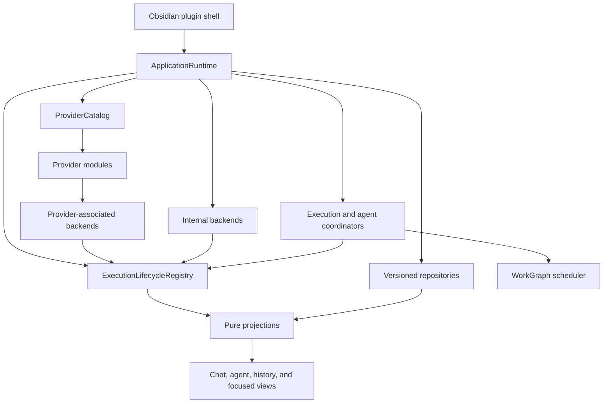

# Full Execution Architecture Migration Plan

Status: revised plan (v2) for the `providers-migration` branch. **Nothing from this plan is
implemented on this branch.** The first attempt executed the v1 plan through its cutover on
`codex/provider-architecture-research` (77 commits over baseline `710a43cf`, never merged); its
execution core is sound and is harvested by this plan, its cutover broke the product surface and is
not. That branch, its historical progress log, and its retro-active parity audit
(`provider-execution-presentation-parity.md`) remain archived on the remote as evidence and as the
harvesting source.

Checkpoint status for this attempt is recorded in
[`provider-execution-migration-progress.md`](provider-execution-migration-progress.md).

This document is the operational source of truth for replacing Grimoire's provider, chat-execution,
tab, and subagent lifecycle architecture. The architectural reasoning, lifecycle semantics, and the
lessons that force the v2 delivery shape are defined in
[`provider-architecture-research.md`](provider-architecture-research.md).

## Product invariant

At every checkpoint the built plugin is fully functional: it installs, every user-facing surface in
the M0 parity manifest is reachable from `src/main.ts`, and the manual smoke matrix for the touched
area passes. A checkpoint that breaks a baseline surface does not land, regardless of how many
automated suites pass. This invariant is the operational form of the product requirement that the
migration must be invisible to the user while the internals are replaced.

Because the invariant holds at every checkpoint, milestones merge to `main` when their exit gates
pass. There is no long-lived integration branch accumulating divergence; the first attempt's
77-commit unmergeable branch is the anti-pattern this rule exists to prevent.

## Outcome

The migration will replace the old runtime architecture completely, delivered as a series of
independently mergeable milestones rather than one branch-terminal cutover.

The final system will have:

- one application-scoped lifecycle for provider-backed and Grimoire-owned execution;
- explicit backend, session, run, interaction, terminal, recovery, and result contracts;
- durable agent instances and attempts that are independent of tabs;
- a revisioned work graph for dependencies, retries, result provenance, and synthesis;
- pure chat and agent projections that the UI renders but does not own;
- one validated provider catalog instead of separately maintained registries and defaults;
- versioned, privacy-bounded control persistence and serialized conversation mutations;
- provider-native protocols, history, session behavior, files, and security semantics preserved behind adapters;
- equivalent lifecycle, cancellation, cleanup, and recovery guarantees on macOS, Linux, and Windows;
- no production `ChatRuntime`, tab-owned execution, UI-owned subagent lifecycle, or direct process launch from features.

This is not a public provider SDK. Internal TypeScript contracts may change while the topology proofs are being completed. Persisted vault schemas and provider-native data receive the compatibility guarantees.

## Delivery decision

Implementation is staged; production composition changes provider by provider and surface by
surface, never all at once. The v1 decision — one hard composition-root cutover — was attempted and
is rejected on evidence; see "Lessons from the first attempt" in the research document.

The new platform is built and tested directly alongside the current application path. New provider
backends may reuse extracted process, transport, native-session, and history primitives, but they
must not wrap `ChatRuntime` or inherit its generator and callback lifecycle.

The production seam is one provider-neutral presentation adapter that implements the existing
`ChatRuntime` contract on top of an execution backend, session, and run. The dependency direction is
strict: the adapter consumes the new lifecycle; the new core never imports the old contract. Flipping
a provider means replacing its `createRuntime` registration with the adapter over its new backend
and deleting its legacy `*ChatRuntime` in the same checkpoint. There are no runtime flags: a flip is
a commit, reverted as a commit if it cannot pass. Inside one provider there is exactly one execution
authority at any commit; across providers, mixed authorities are accepted during the flip series
because providers share no execution state.

The adapter is under feature freeze from the day it exists: no new capability may be exposed through
the `ChatRuntime` contract. New capabilities land as projections or capability ports on the new
platform. The adapter and the old contract are deleted when their last UI consumer is gone, at a
named checkpoint in the presentation-evolution milestone.

### Harvesting policy

The archived branch is a parts library, not a base:

- harvest by porting (cherry-pick, then fix) onto current `main`; wholesale merge is forbidden;
- eligible: the reviewed slices of Phases 1 through 8 — composition boundaries, persistence
  substrate, execution kernel, fake backend, the nine provider backends and modules, conformance and
  sanitized trace suites, agent/work-graph domain, projection reducers as material;
- not eligible: the Phase 9/10 cutover commits — `main.ts` and `GrimoireView` rewrites, tab
  deletion, stub entry points, legacy-architecture deletion sweeps;
- every harvested slice re-runs its own gates on this branch and is reconciled with the fixes that
  landed on `main` after the old baseline, in particular UTF-8 stream decoding (`utf8Stream`) and
  Grok transcript recovery; the harvested Grok and ACP backends must absorb those semantics rather
  than regress them;
- a harvested slice that fails review on this branch is reworked or rewritten; prior review on the
  archived branch does not exempt it.

## Scope and preservation boundary

### In scope

- application startup, shutdown, recovery, and execution ownership;
- provider registration, settings decoding, capability declarations, workspace lifecycle, and backend factories;
- chat, agent, work-graph, local-shell, inline-edit, title, refine, probe, and warm-up execution;
- provider event ingestion, correlation, cancellation, interactions, terminal outcomes, results, and reconciliation;
- conversation revision control and typed history hydration;
- result-focused agent UI and restored projections;
- migration of all nine existing providers;
- complete deletion of superseded runtime and tab/subagent ownership code.

### Must remain compatible

- `.grimoire/grimoire-settings.json` and current provider configuration meaning;
- `.grimoire/sessions/*.meta.json` and provider-neutral conversation metadata;
- provider-native transcripts, databases, session IDs, branches, and history roots;
- Claude, Codex, Grok, OpenCode-family, Qwen, and Gemini provider-owned files;
- MCP ownership and configuration behavior per provider;
- model selection, command discovery, permissions, approvals, questions, plan mode, steering, resume, fork, rewind, and compaction where genuinely supported;
- existing conversation content and opaque `providerState`;
- cold blank tabs and lazy first conversation creation;
- image and persisted-content cleanup rules;
- current local-shell product enablement policy during the architecture migration.
- supported desktop execution on macOS, Linux, and Windows; platform-specific adapters may differ, but ownership and terminal semantics may not.

### Intentionally changed

Each intentional change lands at its owning milestone, not during the provider flips. Until the
owning milestone, current behavior is preserved exactly — for example, closing a tab continues to
cancel and clean up that tab's work until durable ownership and its UI exist in M5.

- closing a tab or chat view detaches presentation and does not cancel work;
- generator completion is not evidence of success;
- every requested run has one explicit terminal outcome and an independent result expectation;
- worker tabs become optional views over durable work;
- provider workspaces initialize lazily and dispose explicitly;
- settings changes fence affected backend generations;
- unknown side-effect outcomes are never retried automatically;
- multiple views may attach safely after revisioned persistence is active.

### Out of scope

- a third-party provider plugin ABI;
- a provider marketplace or dynamic code loading;
- replacing provider-native transcript storage with a Grimoire database;
- normalizing every provider protocol or agent detail;
- changing provider feature semantics merely to make their capability tables uniform;
- new end-user capabilities on the old runtime path.

## Target dependency graph



Allowed dependency direction:

```text
main.ts
  -> app/ApplicationRuntime
       -> core provider catalog and repositories
       -> core execution lifecycle
       -> core agents and work graphs
       -> provider and internal backend factories

providers/<provider>
  -> core contracts
  -> provider-owned protocol, storage, and runtime primitives

features
  -> application command ports
  -> immutable projections and selectors

views and tabs
  -> feature controllers and projections
```

Permanent forbidden directions:

- `src/core/**` to `src/main.ts`, a concrete provider, feature, DOM, or Obsidian API;
- `src/providers/**` to chat feature controllers or tab classes;
- `src/features/**` to provider runtime, protocol, or native-history implementations;
- tabs and views to backend creation, process ownership, provider event streams, or lifecycle disposal;
- lifecycle and agent aggregates to render objects or timers;
- provider-ID switches in core execution or chat rendering;
- direct `child_process`, process spawn, or provider query loops from feature code.

An automated architecture fitness test will enforce these directions from Phase 1 onward.

## Target source layout

The exact file split may be adjusted when a module remains cohesive, but ownership must converge on this layout:

```text
src/app/
  ApplicationRuntime.ts
  ApplicationServices.ts

src/core/execution/
  ids.ts
  descriptor.ts
  backend.ts
  events.ts
  state.ts
  results.ts
  recovery.ts
  ExecutionLifecycleRegistry.ts
  EventIngestor.ts
  InteractionBroker.ts
  internal/LocalShellBackend.ts

src/core/agents/
  definition.ts
  instance.ts
  run.ts
  results.ts
  policies.ts
  AgentCoordinator.ts

src/core/work/
  WorkGraph.ts
  WorkGraphRepository.ts
  WorkScheduler.ts
  SynthesisCoordinator.ts

src/core/conversations/
  ConversationRepository.ts
  ConversationMutationQueue.ts
  HistoryHydrationResult.ts

src/core/providers/
  ProviderModule.ts
  ProviderCatalog.ts
  ProviderCapabilities.ts
  ProviderSettingsCodec.ts
  ProviderWorkspaceManager.ts

src/features/chat/application/
  ChatExecutionCoordinator.ts

src/features/chat/projections/
  ChatProjection.ts
  AgentProjection.ts
  reducers.ts
  selectors.ts

src/features/chat/rendering/
  AgentWorkCard.ts

src/providers/<provider>/execution/
  <Provider>Backend.ts
  <Provider>Session.ts
  <Provider>Run.ts
  <Provider>EventNormalizer.ts

tests/fixtures/provider-traces/
tests/unit/core/execution/
tests/unit/core/agents/
tests/unit/core/work/
tests/unit/core/providers/
tests/unit/features/chat/projections/
tests/integration/providers/
tests/integration/migration/
```

## Core contracts that must survive the migration

### Generic execution identity

Provider identity is association metadata, not the identity of every executable resource.

```ts
interface ExecutionBackendDescriptor {
  backendId: ExecutionBackendId;
  association:
    | { kind: 'provider'; providerId: ProviderId }
    | { kind: 'internal'; service: InternalExecutionServiceId };
}

interface ExecutionBackend {
  readonly descriptor: ExecutionBackendDescriptor;
  createSession(config: ExecutionSessionConfig): Promise<ExecutionSession>;
  dispose(): Promise<void>;
}

interface ExecutionSession {
  readonly executionSessionId: ExecutionSessionId;
  readonly sessionInstanceId: SessionInstanceId;
  createRun(request: ExecutionRequest): ExecutionRun;
  getSnapshot(): ExecutionSessionSnapshot;
  subscribe(listener: ExecutionIngressEventListener): Unsubscribe;
  dispose(): Promise<void>;
}

interface ExecutionRun {
  readonly runId: RunId;
  readonly events: AsyncIterable<ExecutionIngressEvent>;
  cancel(reason?: CancellationReason): Promise<void>;
}
```

The abstraction does not prescribe one process per backend, session, or run. `InternalExecutionServiceId` is a branded identifier validated by application composition rather than a closed capability enum. SDK streams, app-server daemons, ACP subprocesses, stateless processes, and local shell processes fit through composition rather than inheritance.

### Event authority

Adapters emit typed ingress events. One logical-session ingestor assigns the core envelope, sequence, and accepted event identity:

```ts
interface ExecutionEventEnvelopeBase {
  schemaVersion: number;
  backendId: ExecutionBackendId;
  backendGeneration: number;
  executionSessionId: ExecutionSessionId;
  sessionInstanceId: SessionInstanceId;
  eventId: string;
  sequence: number;
  occurredAt: number;
}
```

The ingestor:

- validates event scope before mutation;
- deduplicates using backend generation, logical session, and stable delivery identity;
- sequences run-stream and session-stream events through one authority;
- rejects stale generations, stale session incarnations, wrong owners, and ordinary post-terminal events;
- buffers a bounded reordering window only when a provider exposes causal order;
- turns missing predecessors into typed gaps and reconciliation, never silent skipping;
- routes later proof for an indeterminate run through append-only reconciliation rather than rewriting its terminal.

An adapter without stable replay identity must query status or reconcile a snapshot after reconnect. It must not assign a fresh identity to a redelivered native event and claim deduplication.

### Run outcomes

Every accepted run reaches exactly one of:

- `succeeded`;
- `failed`;
- `cancelled` after confirmed cancellation;
- `interrupted` when execution is known to have stopped safely;
- `invalidated` only before dispatch or after confirmed side-effect-free rejection;
- `indeterminate` when effects or completion cannot be established.

Transport loss first enters nonterminal `disconnected` and `recovering` while status-query, reattach, or checkpoint recovery remains possible. Iterator end is not a terminal fact. A run declares `required`, `optional`, or `none` result expectation; thinking and tool activity cannot satisfy a required visible result.

### Ownership and leases

Every run has one durable owner:

- conversation;
- agent instance;
- work graph;
- auxiliary operation;
- internal service invocation.

Tabs receive projection attachments. The lifecycle registry is the sole authority for backend, session, run, interaction, persistence, and recovery leases. A resource cannot cool while active work, an open interaction, a durable write, a reattach attempt, or a settings transition still owns it.

### Provider modules and capability ports

Each built-in provider contributes one validated module:

```ts
interface ProviderModule {
  manifest: ProviderManifest;
  settings: ProviderSettingsCodec;
  workspace: ProviderWorkspaceContribution;
  execution: ExecutionBackendFactory;
  capabilities: ProviderCapabilityDescriptor;
  features: ProviderFeatureContributions;
}
```

Capabilities are structured and independently traced. At minimum they distinguish:

- process topology;
- session resume from transcript hydration;
- provider-native, Grimoire projection, or absent history ownership;
- static, active-session, ephemeral-process, or unsupported command discovery;
- MCP ownership, session configuration, and per-run selection;
- agent definition inventory from native execution, spawn origin, stable identity, progress observation, result extraction, cancellation, status query, and reattachment;
- fork, rewind, steering, compaction, and each interaction kind;
- `native`, `grimoire`, `advisory`, or `unsupported` security enforcement.

Optional behavior is supplied through narrow capability ports. Unsupported behavior is absent and visible, not a no-op method. Adding a capability does not add another method to the base execution session.

### Agent and work model

The durable identities are separate:

- `AgentDefinition`: reusable configuration and policy request;
- `AgentInstance`: logical participant with a captured definition revision;
- `AgentRun`: one immutable attempt;
- `WorkGraph`: revisioned scheduling and dependency graph;
- `WorkNode`: one goal and assignment;
- `AgentResult`: one attempt's structured result;
- `SynthesisRun`: a normal run referencing exact result IDs.

Parent-child agent ownership remains a tree. Work dependencies remain a directed acyclic graph. Dynamic additions create a new graph revision; they do not mutate the meaning of a revision already used for scheduling.

Grimoire-requested agent dispatch persists intent and a stable dispatch token before calling a provider. Native identity or explicit rejection is persisted before the attempt becomes running. An unknown dispatch never launches again automatically. Retry creates a new attempt.

A child spawned internally by a running provider is an `observed-native` instance. It is adopted idempotently from stable native identity and parent scope without fabricating a prior dispatch intent. Recovery may discover it from provider status, history, or sidecar evidence. Without stable identity, the provider declares aggregate or opaque fidelity and the core does not manufacture a durable child.

Effective permissions are the intersection of provider capability, workspace policy, root hard ceiling, parent policy, and definition request. An approval may activate only a permission already inside an approvable allowance. Provider, workspace, and root hard ceilings cannot be escalated.

Native agent actions are declared independently; a result capability does not imply spawn, cancellation, status query, or reattachment. Observation fidelity is summarized as `full`, `aggregate`, `terminal-only`, `opaque`, or `none`. The core does not invent progress or child identities that a provider cannot expose, and UI actions derive from the individual capability fields rather than the summary label.

### Persistence boundary

The new stores are versioned and provider-neutral. They persist only what is needed for ownership, recovery, projections, and whitelisted results:

- logical IDs, owner links, generations, attempts, and state-machine positions;
- dispatch intents and accepted native opaque identities needed for recovery;
- work graph revisions and scheduling decisions;
- terminal outcomes, result references, and reconciliation evidence;
- projection and conversation revisions;
- shutdown and settings-transition checkpoints.

They do not persist secrets, hidden reasoning, environment digest inputs, arbitrary raw protocol payloads, or a second provider transcript. Local shell output is a bounded result delivered to its projection and is not written into a durable lifecycle journal or advanced debug logs.

Every record has `schemaVersion`. Unknown future versions open read-only and surface a migration-required state. Known older records migrate through explicit, idempotent steps. Writes are atomic, and multi-record operations use an intent plus recoverable completion marker.

Provider-native history remains authoritative. History hydration returns `absent`, `complete`, `partial`, `stale`, `corrupt`, or `recovered` rather than hiding every outcome behind an empty conversation.

## Provider topology and migration waves

| Provider | Native topology | History and session boundary | Agent definitions / observation fidelity | Migration wave |
| --- | --- | --- | --- | --- |
| Antigravity | one print-mode process per run | no native resume; prompt reconstruction | none / `none` | topology proof 1 |
| Codex | persistent app-server with threads and turns | native resume, fork, rollback, and JSONL | native / `full` | topology proof 2 |
| Claude | persistent SDK query and message channel | native resume, fork, rewind, and JSONL tree | native / `full` | topology proof 3 |
| OpenCode | managed ACP subprocess and session | ACP load plus provider-owned database | provider files / `none` | topology proof 4 |
| MiMoCode | managed ACP family with distinct hooks | ACP load plus provider-owned database | provider files / `none` | managed ACP wave |
| Kimi Code | managed ACP family with distinct configuration | ACP load plus provider-owned database | provider files / `none` | managed ACP wave |
| Grok | managed ACP plus provider extensions | native JSONL and ACP resume | native / `aggregate` | extension wave |
| Qwen | persistent ACP session | native resume without transcript hydration | provider files / `opaque` | extension wave |
| Gemini | persistent ACP session | native resume without transcript hydration | provider files / `none` | extension wave |

The contract is not semantically frozen after the easiest provider. It freezes only after Antigravity, Codex, Claude, and OpenCode pass conformance and real sanitized trace parity. Those four prove stateless process, multiplexed daemon, persistent SDK stream, and managed ACP topologies.

OpenCode, MiMoCode, and Kimi Code share only a composed managed-ACP kernel. Launch artifacts, environments, native database schemas, model and mode mapping, history, and error extraction remain provider-owned. Changes to shared lifecycle behavior are verified across all three.

Grok, Qwen, and Gemini use the shared ACP transport primitives but retain distinct adapters. Shared transport is not evidence of shared feature semantics.

## Implementation milestones

Each milestone ends with a green checkpoint and merges to `main` when its exit gate passes. A
milestone may introduce internal code that is not yet composed into production, but it cannot leave
broken tests, a broken product surface, or ambiguous persisted state at its checkpoint. Checkpoint
commits inside a milestone hold the same rule at smaller scope.

### M0 — Baseline and parity gate

Objective: create the evidence and the automated gate the first attempt lacked. Mandatory; no later
milestone may start before M0 is green. Skipping this phase is the recorded root cause of the v1
failure.

Work:

- run the current full local gate and record the baseline commit;
- add a checked-in import-graph walk from `src/main.ts` that resolves relative specifiers, the
  `@/*` alias, side-effect imports, dynamic `import()`, and `require()`;
- add the presentation parity manifest listing every user-facing surface with its expected state
  (`wired`, `intentionally-removed`, or `pending` with an owning milestone item): settings tabs and
  settings search, model selection, slash commands, approvals, questions, plan mode, inline edit,
  file and image context, input toolbar, tabs and history, usage indicators, agent mentions, MCP
  management, and every further surface the walk discovers;
- add a fitness test that fails when the manifest and reality disagree in either direction;
- add sanitized golden traces for new sessions, resume, cancel, process loss, interactions,
  background work, required final result, and provider-native history;
- record process, backend, session, run, concurrency, and recovery topology for every provider;
- reconcile current capability declarations against observed runtime behavior;
- characterize settings, session metadata, persisted tab state, conversation provider state, and
  history hydration — including the UI-facing `ChatRuntime` contract behavior the M2 adapter must
  reproduce;
- add race tests for duplicate terminal, late event, cancellation without acknowledgement, view
  detach, pending save, process death, unknown dispatch, and missing required result;
- decide lifecycle/result retention, user deletion, schema versions, and diagnostic redaction in a
  short internal decision record;
- prohibit new product features on the old runtime path after this checkpoint; bug fixes remain
  allowed and must be absorbed by later harvested slices.

Provider traces must contain Grimoire test identities and normalized timestamps only. Secrets,
prompts, personal paths, and provider payloads not required for parity are removed.

Exit gate:

- every provider has an explicit topology and capability record;
- current behavior is executable as tests or fixtures rather than prose alone;
- the import-graph walk and parity manifest are green and enforced by the test suite;
- known capability mismatches are represented as failing or corrected characterization tests;
- existing provider-native data is byte-preserved by the test harness.

Checkpoint: `test: characterize provider execution lifecycles`

### M1 — Execution core, dark-launched

Objective: land the lifecycle kernel and persistence substrate on this branch without touching
production composition.

Work, harvested from the archived branch per the harvesting policy:

- composition boundaries (v1 Phase 1): `ApplicationServices`, provider context ports,
  `ExecutionBackendDescriptor`, provider module / settings-codec / workspace / capability contracts,
  a validating `ProviderCatalog` fixture, and the architecture fitness test for forbidden imports
  and process launch from features;
- versioned persistence substrate (v1 Phase 2): atomic revisioned repositories, transaction
  intents, schema envelopes, the conversation mutation queue, typed history hydration, and crash
  injection around every multi-record write boundary. Production writes stay on the old path until
  M4; the new repositories are exercised by tests only;
- execution kernel (v1 Phase 3): backend, session, run, owner, lease, generation, interaction,
  result-expectation, and terminal types; the single-writer event ingestor with stable
  deduplication, sequencing, gap handling, and generation fencing; disconnect, recovery,
  cancellation intent, exactly-one-terminal, result validation, shutdown, and append-only
  reconciliation; `LocalShellBackend` as an internal backend (not yet routed from the UI); the
  deterministic fake backend and its fault matrix.

Exit gate:

- exactly one terminal is proven under duplicates, reorder, gaps, cancellation races, unload, and
  reconnect; required results cannot succeed with progress or tool activity alone; projection
  reduction is idempotent;
- core execution has no provider, feature, Obsidian, plugin, or DOM imports;
- macOS and Linux process groups and Windows process trees pass the same ownership, cancellation,
  unload, and terminal conformance cases;
- the parity gate proves the production bundle surface is unchanged.

Checkpoints mirror v1 Phases 1–3: `refactor: define execution composition boundaries`,
`feat: add versioned persistence foundation`, `feat: establish execution lifecycle kernel`.

### M2 — Provider backends, the presentation adapter, and production flips

Objective: replace execution underneath the unchanged UI, one provider at a time.

Topology proofs first, harvested and still dark:

- Antigravity (stateless per-run process), Codex (multiplexed app-server), Claude (persistent SDK
  stream), and OpenCode (managed ACP subprocess), each with backend, module, settings codec,
  capability descriptor, shared conformance, and sanitized trace parity (v1 Phases 4A–4D);
- the semantic freeze happens only after all four topology families pass, unchanged from v1;
- then the remaining backends: MiMoCode and Kimi Code (family rules apply), Grok, Qwen, and Gemini
  (v1 Phase 5), with the post-baseline `main` fixes absorbed — UTF-8 stream decoding and Grok
  transcript recovery are backend semantics now, not patches on the old runtime.

The presentation adapter:

- one provider-neutral implementation of the current `ChatRuntime` contract over an execution
  session and its runs: envelope events map to `StreamChunk` content; interactions map to the
  existing approval, question, and plan-exit callbacks; terminal outcomes map to explicit done or
  error chunks — a terminal without the required result is an explicit error, never a silent empty
  response; `cancel` targets the active run; `buildSessionUpdates` and `consumeTurnMetadata` are
  derived from session snapshots and run metadata; optional contract methods (history, commands,
  rewind/fork, subagent result loading) delegate to capability ports and stay absent where the
  capability is absent;
- adapter conformance: the adapter must pass the M0 UI-facing contract characterization and the
  golden traces of every flipped provider;
- the adapter is under feature freeze from its first commit.

Production flips, one provider per checkpoint, in waves:

1. Antigravity — smallest topology, no resume or agents;
2. Codex; 3. Claude; 4. OpenCode;
5. MiMoCode and Kimi Code; 6. Grok; 7. Qwen; 8. Gemini.

Each flip:

- replaces the provider's `createRuntime` registration with the adapter over its new backend;
- passes that provider's sanitized trace parity, the shared conformance suite, and a manual smoke
  matrix on the built plugin (new session, resume, cancel, approval, history, model selection);
- deletes the provider's legacy `*ChatRuntime` implementation and its now-dead helpers in the same
  checkpoint;
- leaves workspace services, settings surfaces, and every non-execution registration untouched.

Exit gate:

- all nine providers execute through new backends in production;
- no `*ChatRuntime` implementation remains; the `ChatRuntime` interface survives only as the
  adapter's presentation contract;
- trace parity, shared conformance, and the parity manifest are green; the manual smoke matrix
  passes for all nine providers;
- user-visible behavior is unchanged except for corrected defect classes: silent empty responses
  and mis-scoped cancellation.

Checkpoints: one per topology proof, one per flip.

### M3 — Provider control plane behind the existing UI

Objective: one validated catalog replaces the split registries without changing any settings or
workspace surface.

Work:

- harvest the catalog, settings presentation codecs, canonical versioned SHA-256 fingerprints, lazy
  workspace manager, and settings transaction coordinator (v1 Phase 8);
- move registry consumers to the catalog one contribution class at a time — defaults and ordering,
  enablement, settings tabs, model routing, command catalogs, agent mentions, MCP managers, CLI
  resolvers, usage providers, and the rest of the thirteen contribution classes the old
  registrations carry. This is the dependency class whose silent loss broke the first attempt; the
  parity manifest tracks each class explicitly;
- make provider workspaces lazy, failure-isolated, generation-fenced, retryable, and asynchronously
  disposable; one provider failure cannot block startup or another provider;
- delete `ProviderRegistry`, `ProviderWorkspaceRegistry`, and the separately maintained default
  inventories when their last consumer has moved.

Exit gate:

- exactly one catalog contains all nine modules and the registries are deleted;
- settings search, settings tabs, model selection, and workspace behavior are unchanged;
- startup performs no blocking initialization for unused providers;
- settings transitions drain, persist, recycle, and recover idempotently; accepted side-effecting
  runs are never relabelled invalidated.

Checkpoint: `refactor: unify provider control plane`

### M4 — Revisioned persistence in production

Objective: serialized conversation mutations and typed history hydration become the production
path.

Work:

- route conversation saves through the mutation queue and revisioned repository; migrate existing
  vault data through explicit, idempotent steps;
- replace side-effect-only history hydration with the typed result at each call site;
- keep `.grimoire/` layouts compatible per the preservation boundary and document the final layout
  in root storage documentation when the code lands.

Exit gate:

- stale concurrent writers cannot overwrite a newer revision;
- crash injection before and after each intent/completion write recovers idempotently;
- existing vaults open without semantic loss; unknown future schema versions are preserved.

Checkpoint: `feat: adopt revisioned conversation persistence`

### M5 — Presentation evolution: projections, durable work, seam deletion

Objective: move lifecycle ownership out of the feature layer, then delete the seam. Surface by
surface; each step independently shippable and tracked in the parity manifest.

Work:

- chat rendering migrates from generator consumption in `InputController` and `StreamController`
  to projection consumption, rendering into the existing DOM structure; turn acceptance,
  completion, persistence barriers, and queued-input release move to the chat execution
  coordinator. Harvest the v1 Phase 7 reducers and coordinators as material for this rework, not as
  view replacements;
- durable agents and work graphs (v1 Phase 6 harvest): agent instances and attempts survive tab
  close; `SubagentManager` loses lifecycle authority while its rendering is retained; orchestrator
  plans become durable work graphs with explicit synthesis; worker tabs become optional focused
  views;
- tab close stops cancelling background work only in the same checkpoint that ships the
  durable-ownership UI (work cards, reattachment) — never before;
- auxiliary work (title, refine, inline edit, command/model probes, warm-up) moves to isolated
  auxiliary owners; auxiliary results cannot mutate the visible conversation session;
- `BangBashService` routes through `LocalShellBackend`; tab close detaches its projection and
  application shutdown owns cleanup;
- `ApplicationRuntime` becomes the composition root in `main.ts`. By this point it composes parts
  that are already live in production, so the change is a refactor of wiring, not an architecture
  switch; startup recovery completes before views accept work;
- when the last UI consumer of `ChatRuntime` is gone: delete the interface, the presentation
  adapter, lifecycle `StreamChunk` variants, runtime approval/question/plan/subagent callbacks,
  warm-runtime tab LRU ownership, and worker-tab ownership fields, then run the structural deletion
  gates.

Exit gate:

- structural deletion searches are zero in production source;
- every baseline surface remains reachable (parity manifest green) or has a named, recorded removal
  decision;
- agents survive view detach and restart with honest classification; retry preserves prior
  attempts; no approval exceeds a hard permission ceiling;
- the full local gate, trace parity, and the manual test-vault matrix pass.

Checkpoints: `refactor(chat): render execution projections`, `feat: add durable agent work UI`,
`refactor: route auxiliary work through execution owners`,
`refactor!: retire the ChatRuntime seam`

### M6 — Final hardening

Objective: prove the completed replacement (v1 Phase 11 content).

Work:

- run unit, integration, type, lint, release-build, and generated-artifact gates;
- run all sanitized provider traces through the final composition;
- exercise migration crash injection at each durable boundary;
- verify duplicate, gap, stale-generation, wrong-session, late-terminal, unload, and
  uncertain-dispatch behavior;
- verify agent detach, restart, retry, partial failure, synthesis failure, and reconciled result
  UI;
- measure startup and first-use behavior to confirm lazy provider initialization;
- run manual test-vault smoke on the built plugin;
- review privacy boundaries and confirm debug logs contain no newly durable sensitive payloads;
- run an independent architecture and regression review.

Checkpoint: `test: harden lifecycle architecture migration`


## Per-provider trace requirements

Every accepted trace records test-safe backend generation, backend/session incarnation, opaque native session identity when required, Grimoire run ID, native turn identity when available, event order, interactions, agent identities, result expectation, and exactly one terminal.

### Antigravity

- one process per run and reconstructed context;
- cancellation, timeout escalation, nonzero exit, and empty output;
- permission failure and platform-specific transcript handling;
- no fabricated resume, interactive, MCP, command, or agent capability.

### Codex

- initialization handshake and thread start/resume/fork/rollback;
- notifications arriving before turn acceptance;
- steer, interrupt, compact, approval, and user input correlation;
- completed, failed, interrupted, and missing-completion paths exactly once;
- JSONL replay and collaboration agent spawn, wait, input, result, and close.

### Claude

- persistent stream across turns and first native session observation;
- duplicate completion, dynamic update, restart, interrupt, and session recovery;
- fork and rewind branches;
- approval, question, plan exit, sync task, background task, and late notification;
- sidecar hydration and isolated auxiliary query.

### OpenCode, MiMoCode, and Kimi Code

- launch and provider database identity;
- ACP initialize, new, load, and missing-session replacement;
- transient, authentication, and configuration failures without unsafe invalidation;
- retry only before observable output;
- approval and filesystem containment;
- native database hydration and isolated auxiliary execution;
- MiMoCode unsupported-model fallback and stored session error;
- provider-specific configuration, modes, and schema handling for each member.

### Grok

- standard and provider notification deduplication;
- provider-native JSONL and usage/billing behavior;
- missing versus transient resume failure;
- required final assistant result distinct from thinking and tool output;
- direct question, native spawn, polling, asynchronous completion, and result provenance.

### Qwen

- model, mode, effort-control, and user-prompt ordering;
- effort failure prevents user prompt dispatch;
- resume response, structured question, cancellation, active-session command discovery, and context usage;
- nested native activity remains honest and cannot contaminate parent final output;
- replacement session does not duplicate visible history.

### Gemini

- initialize, new, load, and provider session identity;
- model/mode updates, plan/tool/usage normalization, approvals, and path containment;
- replacement context only for a new session;
- transient load failures do not erase a valid binding.

## Test strategy

### Conformance suites

Every backend runs the same deterministic adapter-edge and registry-integration tests for the common
contract:

- disposal and unload ownership;
- owner/session/run identity at the registry boundary;
- cancellation targeting and idempotency;
- exactly-one-terminal behavior;
- required, optional, and absent result expectations;
- timeout, output-limit, and indeterminate cancellation outcomes;
- duplicate ingress, stale generation/incarnation, wrong-session, post-terminal rejection, and
  settings generation fencing at the registry boundary;
- persistence of bounded result references rather than provider output.

The provider-neutral registry suite owns reordered and missing delivery, causal gaps, durable
deduplication, interaction ownership and idempotent resolution, settings-transition recovery, and
crash-boundary behavior. These rules are not adapter extension points. Provider trace suites cover
only capabilities the provider actually declares, including initialization sharing, reconnect,
reattachment, restart recovery, native interactions, agent fidelity, and provider-native history.

Agent-capable backends also run conformance for native identity, fidelity, status, result, cancellation, and recovery. A provider is not required to pass a capability it honestly declares absent.

### Repository and migration suites

- atomic write and crash matrix;
- schema upgrade and unknown-future-version behavior;
- conversation revision conflict and serialized mutation;
- provider-native data preservation;
- partial/corrupt/stale history outcomes;
- settings transition crash recovery;
- dispatch intent crash recovery;
- shutdown checkpoint recovery;
- lifecycle control retention and user deletion.

### Projection suites

- reducer idempotency;
- same final projection under valid delivery reorder;
- required result failure;
- partial output after failure or interruption;
- original indeterminate plus later observed result;
- successful siblings retained after child or synthesis failure;
- restored interactions and available actions;
- tab/view detach without lifecycle mutation;
- honest native fidelity labels and no invented child state.

### Checkpoint commands

Run focused tests first. Every checkpoint then runs:

```bash
npm run test -- --selectProjects unit
npm run typecheck
npm run lint
git diff --check
```

Provider and persistence checkpoints also run:

```bash
npm run test -- --selectProjects integration
```

Every provider flip, the M5 seam deletion, and the final checkpoints run:

```bash
npm run test -- --selectProjects unit
npm run test -- --selectProjects integration
npm run typecheck
npm run lint
npm run build:release
git diff --check
```

## Structural deletion gates

At the M5 seam-deletion checkpoint and again at the M6 gate, these searches must return no production ownership path. During M2 the per-provider searches apply at each flip: a flipped provider's directory may no longer contain a `*ChatRuntime` implementation. Documentation and historical fixture names may be excluded explicitly; broad unexplained allowlists are not accepted.

```bash
rg -n "\bChatRuntime\b|createChatRuntime|createRuntime:" src
rg -n "\bStreamChunk\b|async_subagent_result|subagent_tool_(use|result)" src
rg -n "consumeTurnMetadata|buildSessionUpdates|syncConversationState" src
rg -n "setApprovalCallback|setAskUserQuestionCallback|setExitPlanModeCallback" src
rg -n "setSubagentHookProvider|loadSubagent(ToolCalls|FinalResult)" src
rg -n "\bSubagentManager\b|\bSubagentInfo\b|orphanAllActive" src
rg -n "\bProviderRegistry\b|\bProviderWorkspaceRegistry\b" src
rg -n "createWorkerTab|orchestratorTabId|workerTabIds" src
rg -n "from ['\"][.]+/main['\"]|GrimoirePlugin" src/core
rg -n "for await .*\.query|\.query\(preparedTurn" src/features
rg -n "from ['\"](node:)?child_process['\"]|require\(['\"](node:)?child_process['\"]\)" src/features
rg -n "providers/(claude|codex|antigravity|opencode|mimocode|kimicode|grok|qwen|gemini)/" src/main.ts src/app
```

If a neutral projection content type still needs streamed rendering, it receives a new projection-specific name. The lifecycle meaning of `StreamChunk` is deleted rather than silently retained under ambiguous ownership.

Permanent structural assertions also prove:

- no feature calls provider readiness, query, session ID, cleanup, or cancel APIs;
- no lifecycle or agent file contains DOM types or render timers;
- no provider ID conditional exists in core execution or chat feature behavior;
- `main.ts` and `src/app/**` import only the neutral provider catalog entry point, never a concrete provider module;
- the architecture fitness test resolves imports and known process-launch APIs so aliased `child_process` usage cannot evade the textual gate;
- every built-in provider has exactly one catalog module;
- startup does not initialize unused providers;
- every initialized backend and workspace disposes at most once;
- a generic internal backend works without provider association.

## Stop and revise conditions

Do not work around these findings with optional fields or provider-ID branches. Return to the owning contract milestone when:

- a checkpoint would make any baseline surface unreachable or nonfunctional in the built plugin;
- the presentation adapter needs a new `ChatRuntime` method or capability to keep working;
- the adapter outlives the M5 seam-deletion checkpoint;

and, unchanged from v1, when:

- a backend must expose raw provider protocol payloads to core;
- the core assumes one process or one session topology;
- a provider-native session snapshot is treated as proof of in-flight resume;
- generator or process end is treated as success without terminal evidence;
- a tab, view, DOM object, or feature controller becomes a lifecycle owner;
- unknown dispatch or side effects trigger automatic retry;
- a settings transition discards accepted late effects as invalidated;
- a child approval can exceed any ancestor hard ceiling;
- a result is inferred from thinking or tool activity;
- a provider with definition files is represented as supporting live agent execution;
- persistence duplicates a provider transcript or records sensitive raw events;
- one provider's special feature widens the base session contract;
- an emergency bridge survives its required deletion checkpoint;
- production composition would contain both old and new execution authorities for the same
  provider, or any runtime flag selecting between them. (During M2, different providers on
  different authorities is the planned state, not a violation.)

## Future extension rules

These rules are intended to prevent another architecture replacement as providers and features grow.

### Adding a provider

A new built-in provider adds:

1. one provider directory and nested instructions;
2. one validated `ProviderModule` entry;
3. an execution backend composed from native primitives;
4. settings codec, workspace lifecycle, and explicit capability descriptors;
5. provider-owned history, protocol, launch, model, command, MCP, agent, and security ports as applicable;
6. shared backend conformance and sanitized provider trace fixtures.

It must not require a switch in chat features, settings features, core execution, or application lifecycle. A second consumer may justify a shared helper; one provider does not justify a universal abstraction.

### Adding an execution surface

A new execution feature declares an owner, result expectation, cancellation policy, persistence policy, and projection. It uses an existing provider-associated or internal backend. It does not acquire a runtime from a tab and does not consume native streams in the renderer.

### Adding an agent feature

A new agent capability extends a narrow provider agent port and fidelity descriptor. Generic scheduling, attempts, permissions, results, and projections remain unchanged. If only one provider exposes the feature, its native detail stays provider-owned and may appear as typed opaque provenance.

### Evolving persistence

Every persisted change receives a schema migration, crash test, retention decision, and unknown-version behavior. Internal TypeScript refactors do not force stored-schema changes. Provider-native data stays outside shared migrations.

### Evolving UI

UI actions derive from immutable projection state and declared capabilities, never from provider ID. Multiple views may render the same projection. No view lifecycle changes execution ownership.

## Definition of done

The full migration is complete only when all statements are true:

- `ApplicationRuntime` is the sole application-scoped execution composition root;
- generic backend identity supports provider-associated and internal execution;
- all nine providers use new native backends and one validated catalog;
- all topology, provider, migration, repository, projection, agent, and work-graph suites pass;
- chat, auxiliary operations, orchestration, agents, and local shell use lifecycle owners and projections;
- tabs and views own presentation only;
- provider-native behavior and data pass trace and migration parity;
- restart, unload, settings transitions, cancellation, and unknown outcomes are evidence-based;
- agent results and reconciliation are visible without rewriting operational truth;
- no provider protocol or feature controller leaks into core;
- no production entry point returns a stub, `null`, or a no-op for a capability the baseline
  implemented; a capability that is genuinely dropped is removed together with its call sites, not
  left as a call site that silently succeeds with nothing;
- every module in `src/` is either reachable from `src/main.ts`, reachable from a test, or deleted;
- every structural deletion search is clean;
- the old runtime, split registries, old subagent lifecycle, direct feature process execution, worker ownership, temporary bridges, and architecture flags are gone;
- root and nested architecture documentation describe the implemented system;
- the final full gate and test-vault smoke pass on the branch tip;
- an independent reviewer finds no unresolved lifecycle, persistence, provider-fidelity, security, or migration blocker.

Unlike v1, completed milestones merge to `main` as their exit gates pass — the product invariant
makes every checkpoint shippable. The migration as a whole is complete only when every item above is
true; until then, the seam, the parity manifest, and the feature freeze on the old contract remain
in force.
