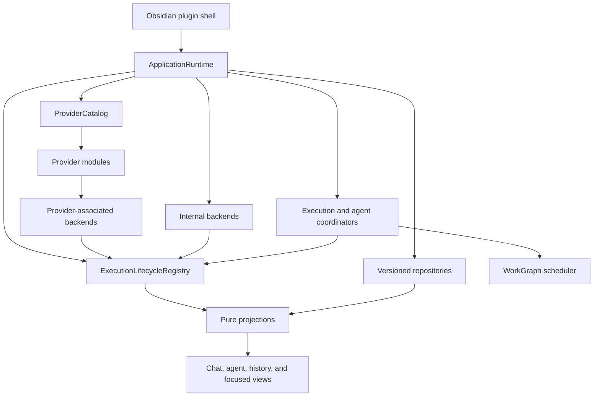

# Full Execution Architecture Migration Plan

Status: approved implementation plan; implementation is complete through Phase 8.

Checkpoint status and verification evidence are recorded in
[`provider-execution-migration-progress.md`](provider-execution-migration-progress.md).

This document is the operational source of truth for replacing Grimoire's current provider, chat-execution, tab, and subagent lifecycle architecture in this branch. The architectural reasoning and lifecycle semantics are defined in
[`provider-architecture-research.md`](provider-architecture-research.md).

## Outcome

The branch will replace the old runtime architecture completely before it is ready to merge.

The final system will have:

- one application-scoped lifecycle for provider-backed and Grimoire-owned execution;
- explicit backend, session, run, interaction, terminal, recovery, and result contracts;
- durable agent instances and attempts that are independent of tabs;
- a revisioned work graph for dependencies, retries, result provenance, and synthesis;
- pure chat and agent projections that the UI renders but does not own;
- one validated provider catalog instead of separately maintained registries and defaults;
- versioned, privacy-bounded control persistence and serialized conversation mutations;
- provider-native protocols, history, session behavior, files, and security semantics preserved behind adapters;
- equivalent lifecycle, cancellation, cleanup, and recovery guarantees on macOS, Linux, and Windows;
- no production `ChatRuntime`, tab-owned execution, UI-owned subagent lifecycle, or direct process launch from features.

This is not a public provider SDK. Internal TypeScript contracts may change while the topology proofs are being completed. Persisted vault schemas and provider-native data receive the compatibility guarantees.

## Delivery decision

Implementation is staged; production composition changes once.

The new platform is built and tested directly alongside the current application path. New provider backends may reuse extracted process, transport, native-session, and history primitives, but they must not wrap `ChatRuntime` or inherit its generator and callback lifecycle.

After every provider, agent, projection, auxiliary operation, and internal executor passes the new contracts, `ApplicationRuntime` becomes the composition root in one hard cutover. The old architecture is then deleted in the same branch. The branch must not merge with two reachable execution paths.

There is no planned provider-by-provider runtime flag and no planned old-runtime-to-new-lifecycle adapter. If an emergency presentation bridge becomes necessary while developing the branch, it may translate new projections to the old renderer only. It must not persist lifecycle state, must live under an explicitly named temporary feature directory, and must be removed in the immediately following checkpoint.

## Scope and preservation boundary

### In scope

- application startup, shutdown, recovery, and execution ownership;
- provider registration, settings decoding, capability declarations, workspace lifecycle, and backend factories;
- chat, agent, work-graph, local-shell, inline-edit, title, refine, probe, and warm-up execution;
- provider event ingestion, correlation, cancellation, interactions, terminal outcomes, results, and reconciliation;
- conversation revision control and typed history hydration;
- result-focused agent UI and restored projections;
- migration of all nine existing providers;
- complete deletion of superseded runtime and tab/subagent ownership code.

### Must remain compatible

- `.grimoire/grimoire-settings.json` and current provider configuration meaning;
- `.grimoire/sessions/*.meta.json` and provider-neutral conversation metadata;
- provider-native transcripts, databases, session IDs, branches, and history roots;
- Claude, Codex, Grok, OpenCode-family, Qwen, and Gemini provider-owned files;
- MCP ownership and configuration behavior per provider;
- model selection, command discovery, permissions, approvals, questions, plan mode, steering, resume, fork, rewind, and compaction where genuinely supported;
- existing conversation content and opaque `providerState`;
- cold blank tabs and lazy first conversation creation;
- image and persisted-content cleanup rules;
- current local-shell product enablement policy during the architecture migration.
- supported desktop execution on macOS, Linux, and Windows; platform-specific adapters may differ, but ownership and terminal semantics may not.

### Intentionally changed

- closing a tab or chat view detaches presentation and does not cancel work;
- generator completion is not evidence of success;
- every requested run has one explicit terminal outcome and an independent result expectation;
- worker tabs become optional views over durable work;
- provider workspaces initialize lazily and dispose explicitly;
- settings changes fence affected backend generations;
- unknown side-effect outcomes are never retried automatically;
- multiple views may attach safely after revisioned persistence is active.

### Out of scope

- a third-party provider plugin ABI;
- a provider marketplace or dynamic code loading;
- replacing provider-native transcript storage with a Grimoire database;
- normalizing every provider protocol or agent detail;
- changing provider feature semantics merely to make their capability tables uniform;
- new end-user capabilities on the old runtime path.

## Target dependency graph



Allowed dependency direction:

```text
main.ts
  -> app/ApplicationRuntime
       -> core provider catalog and repositories
       -> core execution lifecycle
       -> core agents and work graphs
       -> provider and internal backend factories

providers/<provider>
  -> core contracts
  -> provider-owned protocol, storage, and runtime primitives

features
  -> application command ports
  -> immutable projections and selectors

views and tabs
  -> feature controllers and projections
```

Permanent forbidden directions:

- `src/core/**` to `src/main.ts`, a concrete provider, feature, DOM, or Obsidian API;
- `src/providers/**` to chat feature controllers or tab classes;
- `src/features/**` to provider runtime, protocol, or native-history implementations;
- tabs and views to backend creation, process ownership, provider event streams, or lifecycle disposal;
- lifecycle and agent aggregates to render objects or timers;
- provider-ID switches in core execution or chat rendering;
- direct `child_process`, process spawn, or provider query loops from feature code.

An automated architecture fitness test will enforce these directions from Phase 1 onward.

## Target source layout

The exact file split may be adjusted when a module remains cohesive, but ownership must converge on this layout:

```text
src/app/
  ApplicationRuntime.ts
  ApplicationServices.ts

src/core/execution/
  ids.ts
  descriptor.ts
  backend.ts
  events.ts
  state.ts
  results.ts
  recovery.ts
  ExecutionLifecycleRegistry.ts
  EventIngestor.ts
  InteractionBroker.ts
  internal/LocalShellBackend.ts

src/core/agents/
  definition.ts
  instance.ts
  run.ts
  results.ts
  policies.ts
  AgentCoordinator.ts

src/core/work/
  WorkGraph.ts
  WorkGraphRepository.ts
  WorkScheduler.ts
  SynthesisCoordinator.ts

src/core/conversations/
  ConversationRepository.ts
  ConversationMutationQueue.ts
  HistoryHydrationResult.ts

src/core/providers/
  ProviderModule.ts
  ProviderCatalog.ts
  ProviderCapabilities.ts
  ProviderSettingsCodec.ts
  ProviderWorkspaceManager.ts

src/features/chat/application/
  ChatExecutionCoordinator.ts

src/features/chat/projections/
  ChatProjection.ts
  AgentProjection.ts
  reducers.ts
  selectors.ts

src/features/chat/rendering/
  AgentWorkCard.ts

src/providers/<provider>/execution/
  <Provider>Backend.ts
  <Provider>Session.ts
  <Provider>Run.ts
  <Provider>EventNormalizer.ts

tests/fixtures/provider-traces/
tests/unit/core/execution/
tests/unit/core/agents/
tests/unit/core/work/
tests/unit/core/providers/
tests/unit/features/chat/projections/
tests/integration/providers/
tests/integration/migration/
```

## Core contracts that must survive the migration

### Generic execution identity

Provider identity is association metadata, not the identity of every executable resource.

```ts
interface ExecutionBackendDescriptor {
  backendId: ExecutionBackendId;
  association:
    | { kind: 'provider'; providerId: ProviderId }
    | { kind: 'internal'; service: InternalExecutionServiceId };
}

interface ExecutionBackend {
  readonly descriptor: ExecutionBackendDescriptor;
  createSession(config: ExecutionSessionConfig): Promise<ExecutionSession>;
  dispose(): Promise<void>;
}

interface ExecutionSession {
  readonly executionSessionId: ExecutionSessionId;
  readonly sessionInstanceId: SessionInstanceId;
  createRun(request: ExecutionRequest): ExecutionRun;
  getSnapshot(): ExecutionSessionSnapshot;
  subscribe(listener: ExecutionIngressEventListener): Unsubscribe;
  dispose(): Promise<void>;
}

interface ExecutionRun {
  readonly runId: RunId;
  readonly events: AsyncIterable<ExecutionIngressEvent>;
  cancel(reason?: CancellationReason): Promise<void>;
}
```

The abstraction does not prescribe one process per backend, session, or run. `InternalExecutionServiceId` is a branded identifier validated by application composition rather than a closed capability enum. SDK streams, app-server daemons, ACP subprocesses, stateless processes, and local shell processes fit through composition rather than inheritance.

### Event authority

Adapters emit typed ingress events. One logical-session ingestor assigns the core envelope, sequence, and accepted event identity:

```ts
interface ExecutionEventEnvelopeBase {
  schemaVersion: number;
  backendId: ExecutionBackendId;
  backendGeneration: number;
  executionSessionId: ExecutionSessionId;
  sessionInstanceId: SessionInstanceId;
  eventId: string;
  sequence: number;
  occurredAt: number;
}
```

The ingestor:

- validates event scope before mutation;
- deduplicates using backend generation, logical session, and stable delivery identity;
- sequences run-stream and session-stream events through one authority;
- rejects stale generations, stale session incarnations, wrong owners, and ordinary post-terminal events;
- buffers a bounded reordering window only when a provider exposes causal order;
- turns missing predecessors into typed gaps and reconciliation, never silent skipping;
- routes later proof for an indeterminate run through append-only reconciliation rather than rewriting its terminal.

An adapter without stable replay identity must query status or reconcile a snapshot after reconnect. It must not assign a fresh identity to a redelivered native event and claim deduplication.

### Run outcomes

Every accepted run reaches exactly one of:

- `succeeded`;
- `failed`;
- `cancelled` after confirmed cancellation;
- `interrupted` when execution is known to have stopped safely;
- `invalidated` only before dispatch or after confirmed side-effect-free rejection;
- `indeterminate` when effects or completion cannot be established.

Transport loss first enters nonterminal `disconnected` and `recovering` while status-query, reattach, or checkpoint recovery remains possible. Iterator end is not a terminal fact. A run declares `required`, `optional`, or `none` result expectation; thinking and tool activity cannot satisfy a required visible result.

### Ownership and leases

Every run has one durable owner:

- conversation;
- agent instance;
- work graph;
- auxiliary operation;
- internal service invocation.

Tabs receive projection attachments. The lifecycle registry is the sole authority for backend, session, run, interaction, persistence, and recovery leases. A resource cannot cool while active work, an open interaction, a durable write, a reattach attempt, or a settings transition still owns it.

### Provider modules and capability ports

Each built-in provider contributes one validated module:

```ts
interface ProviderModule {
  manifest: ProviderManifest;
  settings: ProviderSettingsCodec;
  workspace: ProviderWorkspaceContribution;
  execution: ExecutionBackendFactory;
  capabilities: ProviderCapabilityDescriptor;
  features: ProviderFeatureContributions;
}
```

Capabilities are structured and independently traced. At minimum they distinguish:

- process topology;
- session resume from transcript hydration;
- provider-native, Grimoire projection, or absent history ownership;
- static, active-session, ephemeral-process, or unsupported command discovery;
- MCP ownership, session configuration, and per-run selection;
- agent definition inventory from native execution, spawn origin, stable identity, progress observation, result extraction, cancellation, status query, and reattachment;
- fork, rewind, steering, compaction, and each interaction kind;
- `native`, `grimoire`, `advisory`, or `unsupported` security enforcement.

Optional behavior is supplied through narrow capability ports. Unsupported behavior is absent and visible, not a no-op method. Adding a capability does not add another method to the base execution session.

### Agent and work model

The durable identities are separate:

- `AgentDefinition`: reusable configuration and policy request;
- `AgentInstance`: logical participant with a captured definition revision;
- `AgentRun`: one immutable attempt;
- `WorkGraph`: revisioned scheduling and dependency graph;
- `WorkNode`: one goal and assignment;
- `AgentResult`: one attempt's structured result;
- `SynthesisRun`: a normal run referencing exact result IDs.

Parent-child agent ownership remains a tree. Work dependencies remain a directed acyclic graph. Dynamic additions create a new graph revision; they do not mutate the meaning of a revision already used for scheduling.

Grimoire-requested agent dispatch persists intent and a stable dispatch token before calling a provider. Native identity or explicit rejection is persisted before the attempt becomes running. An unknown dispatch never launches again automatically. Retry creates a new attempt.

A child spawned internally by a running provider is an `observed-native` instance. It is adopted idempotently from stable native identity and parent scope without fabricating a prior dispatch intent. Recovery may discover it from provider status, history, or sidecar evidence. Without stable identity, the provider declares aggregate or opaque fidelity and the core does not manufacture a durable child.

Effective permissions are the intersection of provider capability, workspace policy, root hard ceiling, parent policy, and definition request. An approval may activate only a permission already inside an approvable allowance. Provider, workspace, and root hard ceilings cannot be escalated.

Native agent actions are declared independently; a result capability does not imply spawn, cancellation, status query, or reattachment. Observation fidelity is summarized as `full`, `aggregate`, `terminal-only`, `opaque`, or `none`. The core does not invent progress or child identities that a provider cannot expose, and UI actions derive from the individual capability fields rather than the summary label.

### Persistence boundary

The new stores are versioned and provider-neutral. They persist only what is needed for ownership, recovery, projections, and whitelisted results:

- logical IDs, owner links, generations, attempts, and state-machine positions;
- dispatch intents and accepted native opaque identities needed for recovery;
- work graph revisions and scheduling decisions;
- terminal outcomes, result references, and reconciliation evidence;
- projection and conversation revisions;
- shutdown and settings-transition checkpoints.

They do not persist secrets, hidden reasoning, environment digest inputs, arbitrary raw protocol payloads, or a second provider transcript. Local shell output is a bounded result delivered to its projection and is not written into a durable lifecycle journal or advanced debug logs.

Every record has `schemaVersion`. Unknown future versions open read-only and surface a migration-required state. Known older records migrate through explicit, idempotent steps. Writes are atomic, and multi-record operations use an intent plus recoverable completion marker.

Provider-native history remains authoritative. History hydration returns `absent`, `complete`, `partial`, `stale`, `corrupt`, or `recovered` rather than hiding every outcome behind an empty conversation.

## Provider topology and migration waves

| Provider | Native topology | History and session boundary | Agent definitions / observation fidelity | Migration wave |
| --- | --- | --- | --- | --- |
| Antigravity | one print-mode process per run | no native resume; prompt reconstruction | none / `none` | topology proof 1 |
| Codex | persistent app-server with threads and turns | native resume, fork, rollback, and JSONL | native / `full` | topology proof 2 |
| Claude | persistent SDK query and message channel | native resume, fork, rewind, and JSONL tree | native / `full` | topology proof 3 |
| OpenCode | managed ACP subprocess and session | ACP load plus provider-owned database | provider files / `none` | topology proof 4 |
| MiMoCode | managed ACP family with distinct hooks | ACP load plus provider-owned database | provider files / `none` | managed ACP wave |
| Kimi Code | managed ACP family with distinct configuration | ACP load plus provider-owned database | provider files / `none` | managed ACP wave |
| Grok | managed ACP plus provider extensions | native JSONL and ACP resume | native / `aggregate` | extension wave |
| Qwen | persistent ACP session | native resume without transcript hydration | provider files / `opaque` | extension wave |
| Gemini | persistent ACP session | native resume without transcript hydration | provider files / `none` | extension wave |

The contract is not semantically frozen after the easiest provider. It freezes only after Antigravity, Codex, Claude, and OpenCode pass conformance and real sanitized trace parity. Those four prove stateless process, multiplexed daemon, persistent SDK stream, and managed ACP topologies.

OpenCode, MiMoCode, and Kimi Code share only a composed managed-ACP kernel. Launch artifacts, environments, native database schemas, model and mode mapping, history, and error extraction remain provider-owned. Changes to shared lifecycle behavior are verified across all three.

Grok, Qwen, and Gemini use the shared ACP transport primitives but retain distinct adapters. Shared transport is not evidence of shared feature semantics.

## Implementation phases

Each phase ends with a green checkpoint commit. A phase may introduce internal code that is not yet composed into production, but it cannot leave broken tests or ambiguous persisted state at its checkpoint.

### Phase 0 — Freeze observed behavior

Objective: create evidence strong enough to detect semantic regression during a destructive migration.

Work:

- run the current full local gate and record the baseline commit;
- add sanitized golden traces for new sessions, resume, cancel, process loss, interactions, background work, required final result, and provider-native history;
- record process, backend, session, run, concurrency, and recovery topology for every provider;
- reconcile current capability declarations against observed runtime behavior;
- characterize settings, session metadata, persisted tab state, conversation provider state, and history hydration;
- add race tests for duplicate terminal, late event, cancellation without acknowledgement, view detach, pending save, process death, unknown dispatch, and missing required result;
- decide lifecycle/result retention, user deletion, schema versions, and diagnostic redaction in a short internal decision record;
- prohibit new product features on the old runtime path after this checkpoint.

Provider traces must contain Grimoire test identities and normalized timestamps only. Secrets, prompts, personal paths, and provider payloads not required for parity are removed.

Exit gate:

- every provider has an explicit topology and capability record;
- current behavior is executable as tests or fixtures rather than prose alone;
- known capability mismatches are represented as failing or corrected characterization tests;
- existing provider-native data is byte-preserved by the test harness.

Checkpoint: `test: characterize provider execution lifecycles`

### Phase 1 — Establish dependency and provider-module boundaries

Objective: make the new architecture independently testable before lifecycle code is introduced.

Work:

- introduce `ApplicationServices` and provider context ports;
- remove concrete `GrimoirePlugin` dependencies from core provider factories;
- define `ExecutionBackendDescriptor`, provider module, settings codec, workspace contribution, and structured capability contracts;
- implement a validating `ProviderCatalog` test fixture without switching production registration;
- reject duplicate IDs, inconsistent identities, missing required contributions, invalid ordering, and unsupported security claims;
- add the architecture fitness test for forbidden imports and process launch from features;
- define the target provider module for a deterministic fake implementation.

The current registries remain untouched as the production path in this phase. No new catalog contribution is derived from a second manually maintained inventory.

Exit gate:

- core compiles without importing `main.ts`;
- a fake module is validated and constructed without Obsidian, DOM, feature, or concrete plugin types;
- the fitness test fails on a deliberately forbidden fixture;
- provider module contracts contain no provider protocol types.

Checkpoint: `refactor: define execution composition boundaries`

### Phase 2 — Add versioned persistence primitives and conversation serialization

Objective: establish atomic storage and revision semantics without designing future domain records before their aggregates exist.

Work:

- add an atomic, revisioned repository substrate and explicit transaction-intent primitive;
- add per-record schema envelopes and explicit read migration results;
- introduce the conversation mutation queue and stale-revision rejection;
- define typed history hydration and recoverable provider-native mutation outcomes;
- preserve current settings, session metadata, conversation state, and provider-native stores through migration fixtures;
- keep opaque provider state round-trippable without shared parsing;
- implement crash injection around every multi-record write boundary.

Concrete lifecycle records are added with the execution aggregate in Phase 3. Agent, result, and work-graph records are added with those aggregates in Phase 6. They reuse the storage substrate and schema rules from this phase instead of predicting their domain shape here.

This phase is the explicit storage migration milestone. It may add new Grimoire-owned files under `.grimoire/`, but it does not rewrite or relocate provider-native data. The final file layout is added to root storage documentation when code lands.

Exit gate:

- stale concurrent conversation writes cannot overwrite a newer revision;
- a crash before and after each intent/completion write recovers idempotently;
- unknown future schema versions are preserved and not rewritten;
- every existing persistence fixture loads without semantic loss;
- persisted test records contain no prohibited payload class.

Checkpoint: `feat: add versioned persistence foundation`

### Phase 3 — Build the generic execution kernel

Objective: prove lifecycle semantics without a production provider.

Work:

- implement backend, session, run, owner, lease, generation, interaction, result-expectation, and terminal types;
- implement the single-writer event ingestor, stable deduplication, sequence assignment, gap handling, and generation fencing;
- implement disconnect, recovery, cancellation intent, exactly-one-terminal, result validation, shutdown, and append-only reconciliation;
- add execution-session, run, interaction, reconciliation, settings-transition, and shutdown-checkpoint repositories using the Phase 2 substrate;
- build a deterministic fake backend that can duplicate, reorder, omit, delay, disconnect, reconnect, reject cancellation, lose dispatch acknowledgement, and emit late events;
- add a fake native-status and snapshot reconciler;
- add a generic backend test whose descriptor has no provider association;
- implement `LocalShellBackend` as an internal backend, but do not yet route the existing UI service through it;
- enforce bounded stdout/stderr, timeout, process-tree cancellation, unload cleanup, and indeterminate outcome for unknown side effects;
- define minimal native-agent ingress and result contracts needed for topology traces without yet building the full work scheduler.

Exit gate:

- exactly one terminal is proven under duplicates, reorder, gaps, cancellation races, unload, and reconnect;
- required results cannot succeed with progress or tool activity alone;
- projection reduction is idempotent;
- later evidence augments but never rewrites an indeterminate terminal;
- local shell never requires a provider ID and cannot leave an uncontrolled child process in tests;
- macOS and Linux process groups and Windows process trees pass the same ownership, cancellation, unload, and terminal conformance cases;
- core execution has no provider, feature, Obsidian, plugin, or DOM imports.

Checkpoint: `feat: establish execution lifecycle kernel`

### Phase 4 — Prove the four execution topologies

Objective: shape the contract through real differences before declaring it stable.

For every backend in this phase:

- extract reusable low-level primitives from the existing provider runtime;
- construct the new backend directly from those primitives;
- keep provider protocol, launch, native IDs, reconnect, history, and security behavior inside its provider directory;
- map explicit terminal and required-result evidence;
- implement backend/module/settings codec and capability descriptors;
- run shared conformance plus provider trace parity;
- keep the production app on its existing path until Phase 9.

#### Phase 4A — Antigravity stateless proof

Prove one process per run, context reconstruction, cancellation, timeout escalation, nonzero exit, empty stdout, permissions, and absence of fabricated session or agent behavior.

Checkpoint: `feat(antigravity): add execution backend`

#### Phase 4B — Codex multiplexed proof

Prove app-server initialization, thread start/resume/fork/rollback, early notifications, steer, interrupt, compact, approvals, user input, missing completion recovery, JSONL reconciliation, and native collaboration agent identity and results.

Checkpoint: `feat(codex): add execution backend`

#### Phase 4C — Claude persistent SDK proof

Prove persistent query ownership, native session observation, duplicate completion handling, dynamic updates versus restart, interrupt and next-turn behavior, resume, fork, rewind, approvals, questions, plan exit, synchronous and background tasks, late task notifications, sidecar hydration, and isolated auxiliary queries.

Checkpoint: `feat(claude): add execution backend`

#### Phase 4D — Managed ACP proof with OpenCode

Compose a managed-ACP kernel from existing transport, process, approval, session, resume, and database-reader primitives. Prove initialize/new/load, missing-session replacement, transient failure, retry only before observable output, approval containment, provider database history, and isolated auxiliary sessions. The shared kernel owns transport mechanics, not product lifecycle or provider semantics.

Checkpoint: `feat(opencode): add managed ACP execution backend`

Semantic freeze gate:

- all four real topology families and the fake backend pass the same common-semantics lifecycle
  conformance suite;
- no provider needs protocol-private fields in core;
- provider-native histories and IDs retain trace parity;
- agent fidelity can be expressed honestly without fabricating events;
- an independent architecture review approves the boundary.

The conformance contract is layered by ownership and only freezes semantics that are genuinely
common. Every backend runs the same adapter-edge cases and the same registry-integrated cases.
Ordering, deduplication, stale delivery, settings-transition, interaction, persistence, and recovery
rules that only the core registry may decide are tested once against the deterministic registry
harness. Initialization sharing, reconnect, reattachment, and restart recovery are topology-specific:
they remain mandatory in each provider's sanitized trace suite, but are not given fabricated uniform
behavior. Provider-specific interaction and agent capabilities are checked against each provider's
declared capability and actual backend event trace. Repeating core policy inside every adapter would
create five competing lifecycle implementations instead of one platform.

After this gate, changes to lifecycle semantics require a recorded reason and conformance updates across all four topology proofs. This is an internal semantic freeze, not a public binary or source compatibility promise.

### Phase 5 — Complete provider backends and modules

Objective: ensure the new catalog can construct every current provider without widening the base runtime contract.

Order:

1. MiMoCode and Kimi Code through managed-ACP composition and provider-specific hooks;
2. Grok with notification deduplication, native history, billing extension, direct question flow, and provider-shaped native agents;
3. Qwen with ordered effort control, active-session commands, structured questions, and opaque nested agent evidence;
4. Gemini with native resume, replacement-session context, approvals, and provider-specific session-ID handling.

Rules:

- OpenCode, MiMoCode, and Kimi Code shared changes are verified as a family;
- Grok, Qwen, and Gemini do not inherit feature semantics merely because they use ACP transport;
- definition inventory does not imply executable child-agent lifecycle;
- unsupported features are absent rather than successful no-ops;
- observed trace behavior overrides stale capability metadata;
- every provider supplies exactly one validated module, backend factory, settings codec, workspace contribution, and feature-port set.

Exit gate:

- all nine providers pass backend conformance and their own sanitized trace suite;
- the catalog has one complete immutable inventory;
- provider-native data and feature semantics retain parity;
- no new backend depends on `ChatRuntime`.

Checkpoints: one provider-scoped commit per adapter or one managed-ACP family commit when the files and tests are inseparable.

### Phase 6 — Add durable agents and work graphs

Objective: make background and coordinated work a domain model rather than a stream or tab convention.

Work:

- implement definition snapshots, instances, attempts, dispatch intents, native identity adoption, and result records;
- distinguish Grimoire-requested dispatch from idempotent adoption of provider-spawned native children;
- implement parent-child ownership separately from work dependencies;
- implement versioned `WorkGraph`, validation, scheduler, concurrency policy, and failure policy;
- add agent-instance, agent-run, result, and work-graph repositories using the Phase 2 substrate;
- implement attached and detached cancellation;
- implement provider/workspace/root/parent permission intersection and approvable allowance;
- map Claude and Codex full native fidelity, Grok provider-shaped fidelity, Qwen opaque evidence, definition-only providers, and Antigravity absence;
- support Grimoire-managed agents through ordinary backend sessions for providers without native execution;
- persist partial and final results, artifacts, changed-file references, citations, usage, errors, and provenance when reliably available;
- make synthesis an explicit run with exact input result IDs;
- recover dispatch crashes without automatic duplicate launch.

Exit gate:

- an agent survives tab and view detach;
- a provider-spawned child is adopted once across duplicate live and recovered evidence;
- restart recovers or honestly classifies every attempt;
- retry creates a new attempt and preserves prior evidence;
- dependency cycles and missing nodes fail before dispatch;
- siblings retain successful results when another node or synthesis fails;
- no approval exceeds a hard permission ceiling;
- providers with limited fidelity render honestly.

Checkpoint: `feat: add durable agents and work graphs`

### Phase 7 — Build application coordinators and projections

Objective: complete the new user-facing path without changing the production composition root yet.

Work:

- implement `ChatExecutionCoordinator` against the new lifecycle commands;
- implement pure chat, interaction, agent, result, and work-card reducers;
- build a parallel input command adapter that leaves turn acceptance, completion, persistence barriers, and queued-input release to the new coordinator;
- build a parallel projection renderer that contains no lifecycle decisions;
- route conversation updates through the revisioned repository in the new path;
- build new tab/view attachment adapters that own only UI state, draft, scroll, selection, and projection attachments;
- implement compact agent work cards, expandable hierarchy, dependency state, interactions, partial/final results, failures, artifacts, and available actions;
- display reconciled outcomes separately from the immutable original terminal;
- retain worker tabs only as optional focused projections;
- translate orchestrator plans into durable work graphs with persisted tasks, dependencies, dispatch failures, results, and explicit synthesis;
- route local shell through `LocalShellBackend` and a projection in the new path; tab close detaches it and application shutdown owns cleanup;
- route title, refine, inline edit, command/model probes, warm-up, and other provider work through explicit auxiliary owners and isolated sessions;
- ensure auxiliary results cannot mutate the visible conversation session.

The new UI path is exercised through fake and new provider backends in tests and a development harness. Existing `InputController`, `StreamController`, tab runtime wiring, and `BangBashService` remain unchanged on the old production path until Phase 9. Phase 7 does not partially mutate or remove them.

Exit gate:

- new feature components issue commands and consume projections only;
- new tab and view adapters do not create, query, cancel, or dispose execution resources;
- final assistant text, thinking, tools, progress, and agent results remain distinct fields;
- missing required result is visible and never treated as empty success;
- local shell has exactly one terminal and no feature-owned process;
- auxiliary sessions cannot cross-contaminate chat history or provider state.

Checkpoints:

- `refactor(chat): render execution projections`
- `feat: add durable agent work UI`
- `refactor: route auxiliary work through execution owners`

### Phase 8 — Complete the new provider control plane

Objective: make one catalog the only source for provider construction and product metadata in the complete new composition before cutover.

Work:

- derive defaults, ordering, enablement, model routing, settings definitions, feature availability, and workspace lookup from validated modules;
- make provider workspaces lazy, failure-isolated, generation-fenced, retryable, and asynchronously disposable;
- use canonical versioned SHA-256 fingerprints only as runtime change detectors;
- preserve unknown provider-owned settings fields and fail closed for security-relevant invalid values;
- implement the settings transaction coordinator over affected backend generations;
- make one provider failure unable to block plugin startup or another provider;
- remove provider-ID branching from the planned application and chat composition;
- add catalog parity tests for every built-in provider.

The unchanged old production path may still read its existing registries until Phase 9. It cannot contribute data to, override, or become a fallback for the new catalog. The hard cutover stops constructing those registries, and Phase 10 deletes them.

Exit gate:

- exactly one catalog contains all nine modules;
- startup performs no blocking initialization for unused providers;
- settings search and current provider presentation retain behavior;
- generation transitions drain, persist, recycle, and recover idempotently;
- accepted side-effecting runs are never relabelled invalidated.

Checkpoint: `refactor: unify provider control plane`

### Phase 9 — Hard composition-root cutover

Objective: make the complete new architecture the only live application path.

Work:

- add `ApplicationRuntime` as owner of catalog, repositories, lifecycle registry, coordinators, workspace manager, internal backends, startup recovery, and shutdown;
- make `main.ts` an Obsidian composition shell;
- replace existing `InputController`, `StreamController`, tab runtime wiring, worker launch, and `BangBashService` call sites with the Phase 7 command, projection, work-graph, and internal-backend path;
- close the execution acceptance gate before unload work begins;
- finish startup reconciliation before views accept commands;
- attach restored views and tabs to projections;
- enable persistence migration for existing vault data;
- route every provider, agent, chat, auxiliary, orchestration, and local-shell invocation through the new platform;
- run manual test-vault scenarios for detach, reopen, cancel, settings change, restart, agent result, and history recovery;
- run the full local gate and sanitized provider trace parity.

There is no partial production-provider switch. If any provider or execution surface cannot pass, the cutover commit does not land; work returns to the owning earlier phase.

Exit gate:

- production bootstrap constructs no old runtime registry or tab-owned runtime;
- every current user path is present through the new composition;
- existing vault data opens without semantic loss;
- startup and shutdown recovery classify every accepted run;
- manual test-vault evidence agrees with projections and native history.

Checkpoint: `refactor!: cut over to lifecycle architecture`

### Phase 10 — Delete the old architecture

Objective: remove every fallback, duplicate authority, and misleading contract before merge.

Delete or fully replace:

- `src/core/runtime/ChatRuntime.ts` and lifecycle types tied to it;
- every provider `*ChatRuntime.ts` after its low-level primitives have moved to the backend;
- `ProviderRegistry` and `ProviderWorkspaceRegistry`;
- separately maintained provider default and ordering inventories;
- lifecycle `StreamChunk` variants and generator-completion handling;
- runtime callbacks for approvals, questions, plan exit, and subagent hooks;
- superseded lifecycle logic in `InputController`, `StreamController`, and `ConversationController`, deleting files that no longer have a presentation role;
- `SubagentManager`, `ProviderSubagentLifecycleAdapter`, and presentation-owned agent state;
- runtime fields, initialization flags, callback wiring, query loops, cancellation, and cleanup in tabs;
- warm-runtime tab LRU ownership;
- worker-tab ownership fields and fire-and-forget orchestrator dispatch;
- direct `BangBashService` process execution;
- provider-local successful no-op capability services;
- every temporary bridge and architecture flag.

Update root and nested `AGENTS.md`, provider roadmap, architecture documentation, storage documentation, and tests so they describe only the final system.

Exit gate:

- structural deletion searches are zero in production source;
- no temporary architecture directory or flag remains;
- every surviving shared type has one current owner and consumer meaning;
- documentation does not describe a transition state as final behavior.

Checkpoint: `refactor!: remove legacy runtime architecture`

### Phase 11 — Final hardening and branch gate

Objective: prove the branch is safe to merge as one complete architecture replacement.

Work:

- run unit, integration, type, lint, release-build, and generated-artifact gates;
- run all sanitized provider traces through the final composition;
- exercise migration crash injection at each durable boundary;
- verify duplicate, gap, stale-generation, wrong-session, late-terminal, unload, and uncertain-dispatch behavior;
- verify agent detach, restart, retry, partial failure, synthesis failure, and reconciled result UI;
- measure startup and first-use behavior to confirm lazy provider initialization;
- run manual test-vault smoke on the built plugin;
- review privacy boundaries and confirm debug logs contain no newly durable sensitive payloads;
- run an independent architecture and regression review;
- synchronize the branch with current main only at a green checkpoint and rerun all gates.

Branch completion requires every definition-of-done item below. Near completion, remaining old code is a blocker, not accepted debt.

Checkpoint: `test: harden lifecycle architecture migration`

## Per-provider trace requirements

Every accepted trace records test-safe backend generation, backend/session incarnation, opaque native session identity when required, Grimoire run ID, native turn identity when available, event order, interactions, agent identities, result expectation, and exactly one terminal.

### Antigravity

- one process per run and reconstructed context;
- cancellation, timeout escalation, nonzero exit, and empty output;
- permission failure and platform-specific transcript handling;
- no fabricated resume, interactive, MCP, command, or agent capability.

### Codex

- initialization handshake and thread start/resume/fork/rollback;
- notifications arriving before turn acceptance;
- steer, interrupt, compact, approval, and user input correlation;
- completed, failed, interrupted, and missing-completion paths exactly once;
- JSONL replay and collaboration agent spawn, wait, input, result, and close.

### Claude

- persistent stream across turns and first native session observation;
- duplicate completion, dynamic update, restart, interrupt, and session recovery;
- fork and rewind branches;
- approval, question, plan exit, sync task, background task, and late notification;
- sidecar hydration and isolated auxiliary query.

### OpenCode, MiMoCode, and Kimi Code

- launch and provider database identity;
- ACP initialize, new, load, and missing-session replacement;
- transient, authentication, and configuration failures without unsafe invalidation;
- retry only before observable output;
- approval and filesystem containment;
- native database hydration and isolated auxiliary execution;
- MiMoCode unsupported-model fallback and stored session error;
- provider-specific configuration, modes, and schema handling for each member.

### Grok

- standard and provider notification deduplication;
- provider-native JSONL and usage/billing behavior;
- missing versus transient resume failure;
- required final assistant result distinct from thinking and tool output;
- direct question, native spawn, polling, asynchronous completion, and result provenance.

### Qwen

- model, mode, effort-control, and user-prompt ordering;
- effort failure prevents user prompt dispatch;
- resume response, structured question, cancellation, active-session command discovery, and context usage;
- nested native activity remains honest and cannot contaminate parent final output;
- replacement session does not duplicate visible history.

### Gemini

- initialize, new, load, and provider session identity;
- model/mode updates, plan/tool/usage normalization, approvals, and path containment;
- replacement context only for a new session;
- transient load failures do not erase a valid binding.

## Test strategy

### Conformance suites

Every backend runs the same deterministic adapter-edge and registry-integration tests for the common
contract:

- disposal and unload ownership;
- owner/session/run identity at the registry boundary;
- cancellation targeting and idempotency;
- exactly-one-terminal behavior;
- required, optional, and absent result expectations;
- timeout, output-limit, and indeterminate cancellation outcomes;
- duplicate ingress, stale generation/incarnation, wrong-session, post-terminal rejection, and
  settings generation fencing at the registry boundary;
- persistence of bounded result references rather than provider output.

The provider-neutral registry suite owns reordered and missing delivery, causal gaps, durable
deduplication, interaction ownership and idempotent resolution, settings-transition recovery, and
crash-boundary behavior. These rules are not adapter extension points. Provider trace suites cover
only capabilities the provider actually declares, including initialization sharing, reconnect,
reattachment, restart recovery, native interactions, agent fidelity, and provider-native history.

Agent-capable backends also run conformance for native identity, fidelity, status, result, cancellation, and recovery. A provider is not required to pass a capability it honestly declares absent.

### Repository and migration suites

- atomic write and crash matrix;
- schema upgrade and unknown-future-version behavior;
- conversation revision conflict and serialized mutation;
- provider-native data preservation;
- partial/corrupt/stale history outcomes;
- settings transition crash recovery;
- dispatch intent crash recovery;
- shutdown checkpoint recovery;
- lifecycle control retention and user deletion.

### Projection suites

- reducer idempotency;
- same final projection under valid delivery reorder;
- required result failure;
- partial output after failure or interruption;
- original indeterminate plus later observed result;
- successful siblings retained after child or synthesis failure;
- restored interactions and available actions;
- tab/view detach without lifecycle mutation;
- honest native fidelity labels and no invented child state.

### Checkpoint commands

Run focused tests first. Every checkpoint then runs:

```bash
npm run test -- --selectProjects unit
npm run typecheck
npm run lint
git diff --check
```

Provider and persistence checkpoints also run:

```bash
npm run test -- --selectProjects integration
```

The cutover and final checkpoints run:

```bash
npm run test -- --selectProjects unit
npm run test -- --selectProjects integration
npm run typecheck
npm run lint
npm run build:release
git diff --check
```

## Structural deletion gates

At Phase 10 and again before merge, these searches must return no production ownership path. Documentation and historical fixture names may be excluded explicitly; broad unexplained allowlists are not accepted.

```bash
rg -n "\bChatRuntime\b|createChatRuntime|createRuntime:" src
rg -n "\bStreamChunk\b|async_subagent_result|subagent_tool_(use|result)" src
rg -n "consumeTurnMetadata|buildSessionUpdates|syncConversationState" src
rg -n "setApprovalCallback|setAskUserQuestionCallback|setExitPlanModeCallback" src
rg -n "setSubagentHookProvider|loadSubagent(ToolCalls|FinalResult)" src
rg -n "\bSubagentManager\b|\bSubagentInfo\b|orphanAllActive" src
rg -n "\bProviderRegistry\b|\bProviderWorkspaceRegistry\b" src
rg -n "createWorkerTab|orchestratorTabId|workerTabIds" src
rg -n "from ['\"][.]+/main['\"]|GrimoirePlugin" src/core
rg -n "for await .*\.query|\.query\(preparedTurn" src/features
rg -n "from ['\"](node:)?child_process['\"]|require\(['\"](node:)?child_process['\"]\)" src/features
rg -n "providers/(claude|codex|antigravity|opencode|mimocode|kimicode|grok|qwen|gemini)/" src/main.ts src/app
```

If a neutral projection content type still needs streamed rendering, it receives a new projection-specific name. The lifecycle meaning of `StreamChunk` is deleted rather than silently retained under ambiguous ownership.

Permanent structural assertions also prove:

- no feature calls provider readiness, query, session ID, cleanup, or cancel APIs;
- no lifecycle or agent file contains DOM types or render timers;
- no provider ID conditional exists in core execution or chat feature behavior;
- `main.ts` and `src/app/**` import only the neutral provider catalog entry point, never a concrete provider module;
- the architecture fitness test resolves imports and known process-launch APIs so aliased `child_process` usage cannot evade the textual gate;
- every built-in provider has exactly one catalog module;
- startup does not initialize unused providers;
- every initialized backend and workspace disposes at most once;
- a generic internal backend works without provider association.

## Stop and revise conditions

Do not work around these findings with optional fields or provider-ID branches. Return to the owning contract phase when:

- a backend must expose raw provider protocol payloads to core;
- the core assumes one process or one session topology;
- a provider-native session snapshot is treated as proof of in-flight resume;
- generator or process end is treated as success without terminal evidence;
- a tab, view, DOM object, or feature controller becomes a lifecycle owner;
- unknown dispatch or side effects trigger automatic retry;
- a settings transition discards accepted late effects as invalidated;
- a child approval can exceed any ancestor hard ceiling;
- a result is inferred from thinking or tool activity;
- a provider with definition files is represented as supporting live agent execution;
- persistence duplicates a provider transcript or records sensitive raw events;
- one provider's special feature widens the base session contract;
- an emergency bridge survives its required deletion checkpoint;
- production composition would contain both old and new execution authorities.

## Future extension rules

These rules are intended to prevent another architecture replacement as providers and features grow.

### Adding a provider

A new built-in provider adds:

1. one provider directory and nested instructions;
2. one validated `ProviderModule` entry;
3. an execution backend composed from native primitives;
4. settings codec, workspace lifecycle, and explicit capability descriptors;
5. provider-owned history, protocol, launch, model, command, MCP, agent, and security ports as applicable;
6. shared backend conformance and sanitized provider trace fixtures.

It must not require a switch in chat features, settings features, core execution, or application lifecycle. A second consumer may justify a shared helper; one provider does not justify a universal abstraction.

### Adding an execution surface

A new execution feature declares an owner, result expectation, cancellation policy, persistence policy, and projection. It uses an existing provider-associated or internal backend. It does not acquire a runtime from a tab and does not consume native streams in the renderer.

### Adding an agent feature

A new agent capability extends a narrow provider agent port and fidelity descriptor. Generic scheduling, attempts, permissions, results, and projections remain unchanged. If only one provider exposes the feature, its native detail stays provider-owned and may appear as typed opaque provenance.

### Evolving persistence

Every persisted change receives a schema migration, crash test, retention decision, and unknown-version behavior. Internal TypeScript refactors do not force stored-schema changes. Provider-native data stays outside shared migrations.

### Evolving UI

UI actions derive from immutable projection state and declared capabilities, never from provider ID. Multiple views may render the same projection. No view lifecycle changes execution ownership.

## Definition of done

The full migration is complete only when all statements are true:

- `ApplicationRuntime` is the sole application-scoped execution composition root;
- generic backend identity supports provider-associated and internal execution;
- all nine providers use new native backends and one validated catalog;
- all topology, provider, migration, repository, projection, agent, and work-graph suites pass;
- chat, auxiliary operations, orchestration, agents, and local shell use lifecycle owners and projections;
- tabs and views own presentation only;
- provider-native behavior and data pass trace and migration parity;
- restart, unload, settings transitions, cancellation, and unknown outcomes are evidence-based;
- agent results and reconciliation are visible without rewriting operational truth;
- no provider protocol or feature controller leaks into core;
- every structural deletion search is clean;
- the old runtime, split registries, old subagent lifecycle, direct feature process execution, worker ownership, temporary bridges, and architecture flags are gone;
- root and nested architecture documentation describe the implemented system;
- the final full gate and test-vault smoke pass on the branch tip;
- an independent reviewer finds no unresolved lifecycle, persistence, provider-fidelity, security, or migration blocker.

Until every item is satisfied, this branch remains an implementation branch and is not ready to merge.
