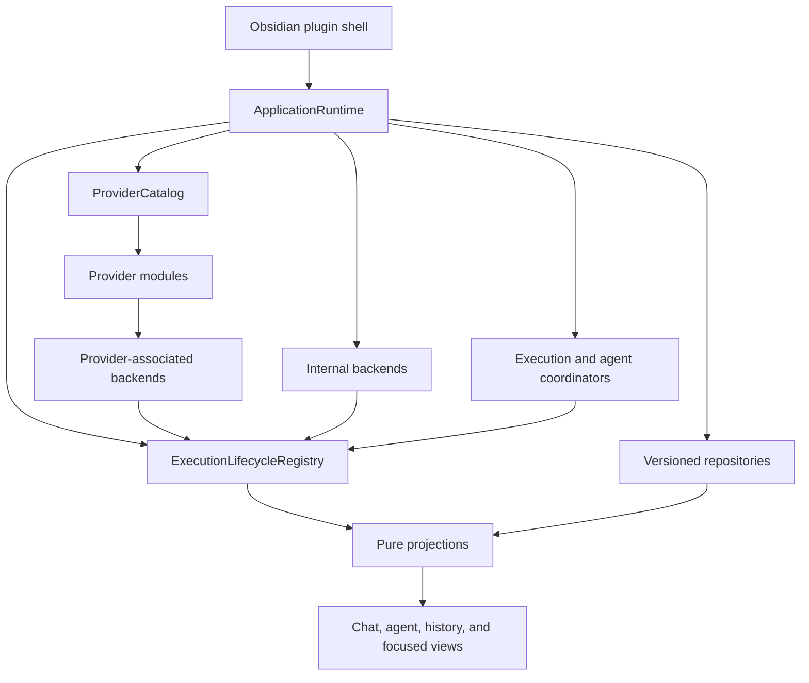

# Full Execution Architecture Migration Plan

Status: revised plan (v2) for the `providers-migration` branch. **M0a and M1 are complete; M2-proofs
is in progress and M0b is open.** The authoritative, per-checkpoint state is
[`provider-execution-migration-progress.md`](provider-execution-migration-progress.md) — this line
records only which milestone the reader should expect to find in the tree, and the log's
"Current blocker" is the resume pointer. The first attempt executed the v1 plan through its cutover on
`codex/provider-architecture-research` (77 commits over baseline `710a43cf`, never merged); its
execution core is sound and is harvested by this plan, its cutover broke the product surface and is
not. That branch, its historical progress log, and its retro-active parity audit
(`provider-execution-presentation-parity.md`) remain archived on the remote as evidence and as the
harvesting source.

Checkpoint status for this attempt is recorded in
[`provider-execution-migration-progress.md`](provider-execution-migration-progress.md).

This document is the operational source of truth for replacing Grimoire's provider, chat-execution,
tab, and subagent lifecycle architecture. The architectural reasoning, lifecycle semantics, and the
lessons that force the v2 delivery shape are defined in
[`provider-architecture-research.md`](provider-architecture-research.md).

## Product invariant

At every checkpoint the built plugin is fully functional: it installs, every user-facing surface in
the M0a parity manifest is reachable from `src/main.ts`, and the manual smoke matrix for the touched
area passes. A checkpoint that breaks a baseline surface does not land, regardless of how many
automated suites pass. This invariant is the operational form of the product requirement that the
migration must be invisible to the user while the internals are replaced.

The invariant is enforced by layered checks, and the layers prove different things:

1. **Reachability** — the import-graph walk, parity manifest, and contribution-inventory fitness
   tests (added in M0a) prove every surface is in the bundle and wired;
2. **Renderability at the entry point** — the existing release gates `verify-release-load.cjs`
   (the built bundle loads in isolation) and `verify-release-smoke.cjs` (the view constructs and
   opens), already wired into `npm run build:release` on `main`, run at every checkpoint that runs
   the release build;
3. **Behavior** — the M0a contract characterization suites, adapter conformance, and provider
   trace parity;
4. **Full surface** — the capability-driven manual smoke matrix.

Reachability does not imply renderability, and the view-open smoke covers only the entry point —
which is why layer 4 cannot be skipped at flip and milestone checkpoints. Extending the automated
view-open smoke to deeper surfaces is welcome at any milestone; it never substitutes for the
manual matrix.

Because the invariant holds at every checkpoint, every milestone is *mergeable* to `main` when its
exit gate passes. Whether it is actually merged is a project decision, recorded below.

**Branch policy (owner's decision, 2026-08-15): milestones are not merged to `main`. All migration
work stays on `providers-migration`.** The original rule required merging at each gate, because the
first attempt's 77-commit unmergeable branch was the anti-pattern to avoid. Holding the work on one
branch reintroduces that divergence risk, so the mitigation is mandatory and replaces the merge:

- **sync `main` into `providers-migration` at every milestone gate**, and whenever `main` ships a
  release. A milestone gate is not green until the branch contains current `main`;
- the product invariant is unchanged and still enforced per checkpoint, which is what keeps each
  milestone mergeable whenever the decision is revisited;
- the checkpoint's evidence entry records the `main` commit the branch was synced to, so divergence
  is a measured number rather than a surprise discovered at merge time.

### Release train

`main` keeps shipping releases while the migration proceeds on its own branch, which imposes four
rules:

- dark code must pass the release gates from its first commit: `review:source`, lint, and the
  dependency review all scan the source tree regardless of reachability, and the kernel adds no
  runtime dependencies. The parity gate is what proves dark code stays out of the shipped bundle;
- the declared defect-fix classes that ship with flips are user-visible and get `CHANGELOG.md`
  entries per the repository release rules; invisible infrastructure milestones need none;
- a flip that shipped in a release is still revertible as a commit, but the revert is itself a
  release; the revert-safety rule in M2-flips (control-store files inert to the old path) is what
  makes that release safe;
- because milestones are not merged, a release containing migration work requires the branch to be
  released from, or the work to be merged deliberately at that point. Until then `main` releases
  contain no migration code, and every `main` fix must be absorbed by the branch through the
  milestone-gate sync above.

## Resumable by construction

The migration must be droppable at any moment and resumable on a different machine by a different
person or agent. That is a standing requirement, not a courtesy:

- the documents in `docs/` — this plan, the research document, the contribution inventory, and the
  progress log — are the only canon. Continuing must never require chat transcripts, files outside
  the repository, or anyone's memory;
- every checkpoint commit includes its progress-log entry **in the same commit**, so the journal
  can never lag the code it describes;
- stopping mid-milestone is legal only in one of two states: uncommitted work is discarded, or it
  is committed to the branch with an open-items entry in the progress log saying exactly what is
  unfinished and what the next action is. A dirty working tree is not a valid stopping point;
- the migration branch lives on `origin`; push at every checkpoint. Work continues on
  `providers-migration` across every milestone and is not merged to `main` (see the branch policy);
  if a different branch ever becomes the active one, the progress log's "Current blocker" line
  names it;
- the harvest source map below pins exact v1 commits, so harvesting is reproducible anywhere the
  remote is reachable;
- the progress log's "Current blocker" line is the single resume pointer: a new machine starts by
  reading plan → inventory → progress, then acts on that line.

## Outcome

The migration will replace the old runtime architecture completely, delivered as a series of
independently mergeable milestones rather than one branch-terminal cutover.

The final system will have:

- one application-scoped lifecycle for provider-backed and Grimoire-owned execution;
- explicit backend, session, run, interaction, terminal, recovery, and result contracts;
- durable agent instances and attempts that are independent of tabs;
- a revisioned work graph for dependencies, retries, result provenance, and synthesis — as a
  post-migration extension built on the delivered agent domain, not as part of this migration's
  definition of done;
- pure chat and agent projections that the UI renders but does not own;
- one validated provider catalog instead of separately maintained registries and defaults;
- versioned, privacy-bounded control persistence and serialized conversation mutations;
- provider-native protocols, history, session behavior, files, and security semantics preserved behind adapters;
- equivalent lifecycle, cancellation, cleanup, and recovery guarantees on macOS, Linux, and Windows;
- no production `ChatRuntime`, tab-owned execution, UI-owned subagent lifecycle, or direct process launch from features.

This is not a public provider SDK. Internal TypeScript contracts may change while the topology proofs are being completed. Persisted vault schemas and provider-native data receive the compatibility guarantees.

## Delivery decision

Implementation is staged; production composition changes provider by provider and surface by
surface, never all at once. The v1 decision — one hard composition-root cutover — was attempted and
is rejected on evidence; see "Lessons from the first attempt" in the research document.

The new platform is built and tested directly alongside the current application path. New provider
backends may reuse extracted process, transport, native-session, and history primitives, but they
must not wrap `ChatRuntime` or inherit its generator and callback lifecycle.

The production seam is one provider-neutral presentation adapter that implements the existing
`ChatRuntime` contract on top of the execution lifecycle — and specifically as a client of the
`ExecutionLifecycleRegistry`, never of a bare backend or session. The guarantees each flip exists
for (exactly one terminal, deduplication, generation fencing, honest `indeterminate`) are registry
and ingestor functions, not backend functions; an adapter wired straight to a backend would either
lack them or re-implement core policy locally, and both are forbidden. The dependency direction is
strict: the adapter consumes the new lifecycle; the new core never imports the old contract.

A consequence the plan owns explicitly: **the kernel enters production at the first flip, not at
M4 or M5.** The first flip brings the lifecycle registry, its event ingestion, and its durable
control records into the running plugin. See the M2-flips section for the interim composition
owner, storage-documentation, unload, and revert-safety obligations this creates. Flipping
a provider means replacing its `createRuntime` registration with the adapter over its new backend
and deleting its legacy `*ChatRuntime` in the same checkpoint. There are no runtime flags: a flip is
a commit, reverted as a commit if it cannot pass. Inside one provider there is exactly one **chat
execution** authority at any commit; across providers, mixed authorities are accepted during the
flip series because providers share no execution state.

The chat qualifier is deliberate. A flip moves only `createRuntime`; the provider's auxiliary
execution paths — `createTitleGenerationService`, `createInstructionRefineService`,
`createInlineEditService` — and its workspace-driven services remain on the legacy path until their
milestones (M3/M5, per the contribution inventory). A flipped provider therefore intentionally runs
new chat execution beside legacy auxiliary execution. This mixed state is planned and bounded, with
one hard rule: the two paths must not contend for the same provider session or process. For
persistent-topology providers (Codex app-server, Claude SDK, managed ACP) the flip work must verify
that auxiliary services use their own isolated sessions or processes, as they do today; any
observed session reuse, process contention, or state corruption between the new chat backend and a
legacy auxiliary path is a stop condition for that provider's flip.

The adapter is under feature freeze from the day it exists: no new capability may be exposed through
the `ChatRuntime` contract. New capabilities land as projections or capability ports on the new
platform. The adapter and the old contract are deleted when their last UI consumer is gone, at a
named checkpoint in the presentation-evolution milestone.

### Harvesting policy

The archived branch is a parts library, not a base:

- harvest by porting (cherry-pick, then fix) onto current `main`; wholesale merge is forbidden;
- eligible: the reviewed slices of Phases 1 through 8 — composition boundaries, the narrow
  kernel-record persistence support, execution kernel, fake backend, the nine provider backends and
  modules, conformance and sanitized trace suites, the durable agent instance/attempt domain
  (excluding the WorkGraph scheduler and synthesis, per ban 2), projection reducers as material;
- not eligible: the Phase 9/10 cutover commits — `main.ts` and `GrimoireView` rewrites, tab
  deletion, stub entry points, legacy-architecture deletion sweeps;
- every harvested slice re-runs its own gates on this branch and is reconciled with the fixes that
  landed on `main` after the old baseline, in particular UTF-8 stream decoding (`utf8Stream`) and
  Grok transcript recovery; the harvested Grok and ACP backends must absorb those semantics rather
  than regress them;
- a harvested slice that fails review on this branch is reworked or rewritten; prior review on the
  archived branch does not exempt it.

Three explicit harvest bans, each rooted in a v1 defect:

1. **The v1 `ProviderModule` is never harvested verbatim.** It is known defective: no slots for most
   of the contribution inventory, workspace ports typed as bare `object`. The M1 contract is
   designed against [`provider-contribution-inventory.md`](provider-contribution-inventory.md);
   only its execution-facing pieces may be reused.
2. **WorkGraph and synthesis are not harvested into M1 and do not block seam deletion.** Durable
   agent instance/attempt records and the work card are the M5 requirement; the dependency DAG and
   synthesis runs arrive when a real dependent workflow exists (post-migration scope).
3. **Windows process-tree conformance is not an M1 blocker** while CI runs Ubuntu only; it becomes
   a hard prerequisite of M2-flips, satisfied by a `windows-latest` CI job, not by a waiver.

### Harvest source map

Exact v1 checkpoints on `codex/provider-architecture-research`, verified against git on
2026-08-15. Fetch with `git fetch origin codex/provider-architecture-research`. This map exists so
harvesting never depends on anyone's memory or on files outside this repository.

| v1 slice | Commit | Harvest target |
|---|---|---|
| Phase 1 — composition boundaries | `1ae6a620` | M1 |
| Phase 2 — persistence foundation | `347586ff` | M1 (narrow kernel records only) and M4 (the rest) |
| Phase 3 — lifecycle kernel + local shell | `1220271a` | M1 |
| Phase 4A — Antigravity backend | `07939092` | M2-proofs |
| Phase 4B — Codex backend | `309f1558` | M2-proofs |
| Phase 4C — Claude backend | `9dda0ebc` | M2-proofs |
| Phase 4D — OpenCode managed-ACP backend | `cb631f53` | M2-proofs |
| Semantic freeze suites | `892eec78` | M2-proofs |
| MiMoCode / Kimi Code backends | `6c4700cf` | before their M2 flip |
| Grok backend | `104c88dd` | before its M2 flip |
| Qwen backend | `d5042ec5` | before its M2 flip |
| Gemini backend | `593b38d0` | before its M2 flip |
| Immutable provider catalog | `d1a41736` | M3 |
| Phase 6 — durable agents (instance/attempt scope only, per ban 2) | `63320547` | M5 |
| Phase 7A — chat projections | `8cab81b4` | M5, as material |
| Phase 7B — agent work UI | `634dc4bb` | M5, as material |
| Phase 7C — auxiliary and local-shell owners | `4ebbd5fa` | M5, as material |
| Phase 8 — provider control plane | `91af3577` | M3 |

Not in the map by design: the Phase 9/10 cutover commits (`e7604e15`, `42ad4474`, and their
follow-ups) — the not-eligible list above.

## Scope and preservation boundary

### In scope

- application startup, shutdown, recovery, and execution ownership;
- provider registration, settings decoding, capability declarations, workspace lifecycle, and backend factories;
- chat, agent, local-shell, inline-edit, title, refine, probe, and warm-up execution;
- provider event ingestion, correlation, cancellation, interactions, terminal outcomes, results, and reconciliation;
- conversation revision control and typed history hydration;
- result-focused agent UI and restored projections;
- migration of all nine existing providers;
- complete deletion of superseded runtime and tab/subagent ownership code.

### Must remain compatible

- `.grimoire/grimoire-settings.json` and current provider configuration meaning;
- `.grimoire/sessions/*.meta.json` and provider-neutral conversation metadata;
- provider-native transcripts, databases, session IDs, branches, and history roots;
- Claude, Codex, Grok, OpenCode-family, Qwen, and Gemini provider-owned files;
- MCP ownership and configuration behavior per provider;
- model selection, command discovery, permissions, approvals, questions, plan mode, steering, resume, fork, rewind, and compaction where genuinely supported;
- existing conversation content and opaque `providerState`;
- cold blank tabs and lazy first conversation creation;
- image and persisted-content cleanup rules;
- current local-shell product enablement policy during the architecture migration.
- supported desktop execution on macOS, Linux, and Windows; platform-specific adapters may differ, but ownership and terminal semantics may not.

### Intentionally changed

Each intentional change lands at its owning milestone, not during the provider flips. Until the
owning milestone, current behavior is preserved exactly — for example, closing a tab continues to
cancel and clean up that tab's work until durable ownership and its UI exist in M5.

- closing a tab or chat view detaches presentation and does not cancel work;
- generator completion is not evidence of success;
- every requested run has one explicit terminal outcome and an independent result expectation;
- worker tabs become optional views over durable work;
- provider workspaces initialize lazily and dispose explicitly;
- settings changes fence affected backend generations;
- unknown side-effect outcomes are never retried automatically;
- multiple views may attach safely after revisioned persistence is active.

### Out of scope

- the dependency `WorkGraph`, scheduler, and synthesis runs — a post-migration extension on the
  delivered agent domain, started only when a real dependent workflow exists;
- a third-party provider plugin ABI;
- a provider marketplace or dynamic code loading;
- replacing provider-native transcript storage with a Grimoire database;
- normalizing every provider protocol or agent detail;
- changing provider feature semantics merely to make their capability tables uniform;
- new end-user capabilities on the old runtime path.

## Target dependency graph



Allowed dependency direction:

```text
main.ts
  -> app/ApplicationRuntime
       -> core provider catalog and repositories
       -> core execution lifecycle
       -> core agents
       -> provider and internal backend factories

providers/<provider>
  -> core contracts
  -> provider-owned protocol, storage, and runtime primitives

features
  -> application command ports
  -> immutable projections and selectors

views and tabs
  -> feature controllers and projections
```

Permanent forbidden directions:

- `src/core/**` to `src/main.ts`, a concrete provider, feature, DOM, or Obsidian API;
- `src/providers/**` to chat feature controllers or tab classes;
- `src/features/**` to provider runtime, protocol, or native-history implementations;
- tabs and views to backend creation, process ownership, provider event streams, or lifecycle disposal;
- lifecycle and agent aggregates to render objects or timers;
- provider-ID switches in core execution or chat rendering;
- direct `child_process`, process spawn, or provider query loops from feature code.

An automated architecture fitness test will enforce these directions from Phase 1 onward.

## Target source layout

The exact file split may be adjusted when a module remains cohesive, but ownership must converge on this layout:

```text
src/app/
  ApplicationRuntime.ts
  ApplicationServices.ts

src/core/execution/
  ids.ts
  descriptor.ts
  backend.ts
  events.ts
  state.ts
  results.ts
  recovery.ts
  ExecutionLifecycleRegistry.ts
  EventIngestor.ts
  InteractionBroker.ts
  internal/LocalShellBackend.ts

src/core/agents/
  definition.ts
  instance.ts
  run.ts
  results.ts
  policies.ts
  AgentCoordinator.ts

src/core/conversations/
  ConversationRepository.ts
  ConversationMutationQueue.ts
  HistoryHydrationResult.ts

src/core/providers/
  ProviderModule.ts
  ProviderCatalog.ts
  ProviderCapabilities.ts
  ProviderSettingsCodec.ts
  ProviderWorkspaceManager.ts

src/features/chat/application/
  ChatExecutionCoordinator.ts

src/features/chat/projections/
  ChatProjection.ts
  AgentProjection.ts
  reducers.ts
  selectors.ts

src/features/chat/rendering/
  AgentWorkCard.ts

src/providers/<provider>/execution/
  <Provider>Backend.ts
  <Provider>Session.ts
  <Provider>Run.ts
  <Provider>EventNormalizer.ts

tests/fixtures/provider-traces/
tests/unit/core/execution/
tests/unit/core/agents/
tests/unit/core/providers/
tests/unit/features/chat/projections/
tests/integration/providers/
tests/integration/migration/
```

## Core contracts that must survive the migration

### Generic execution identity

Provider identity is association metadata, not the identity of every executable resource.

```ts
interface ExecutionBackendDescriptor {
  backendId: ExecutionBackendId;
  association:
    | { kind: 'provider'; providerId: ProviderId }
    | { kind: 'internal'; service: InternalExecutionServiceId };
}

interface ExecutionBackend {
  readonly descriptor: ExecutionBackendDescriptor;
  createSession(config: ExecutionSessionConfig): Promise<ExecutionSession>;
  dispose(): Promise<void>;
}

interface ExecutionSession {
  readonly executionSessionId: ExecutionSessionId;
  readonly sessionInstanceId: SessionInstanceId;
  createRun(request: ExecutionRequest): ExecutionRun;
  getSnapshot(): ExecutionSessionSnapshot;
  subscribe(listener: ExecutionIngressEventListener): Unsubscribe;
  dispose(): Promise<void>;
}

interface ExecutionRun {
  readonly runId: RunId;
  readonly events: AsyncIterable<ExecutionIngressEvent>;
  cancel(reason?: CancellationReason): Promise<void>;
}
```

The abstraction does not prescribe one process per backend, session, or run. `InternalExecutionServiceId` is a branded identifier validated by application composition rather than a closed capability enum. SDK streams, app-server daemons, ACP subprocesses, stateless processes, and local shell processes fit through composition rather than inheritance.

### Event authority

Adapters emit typed ingress events. One logical-session ingestor assigns the core envelope, sequence, and accepted event identity:

```ts
interface ExecutionEventEnvelopeBase {
  schemaVersion: number;
  backendId: ExecutionBackendId;
  backendGeneration: number;
  executionSessionId: ExecutionSessionId;
  sessionInstanceId: SessionInstanceId;
  eventId: string;
  sequence: number;
  occurredAt: number;
}
```

The ingestor:

- validates event scope before mutation;
- deduplicates using backend generation, logical session, and stable delivery identity;
- sequences run-stream and session-stream events through one authority;
- rejects stale generations, stale session incarnations, wrong owners, and ordinary post-terminal events;
- buffers a bounded reordering window only when a provider exposes causal order;
- turns missing predecessors into typed gaps and reconciliation, never silent skipping;
- routes later proof for an indeterminate run through append-only reconciliation rather than rewriting its terminal.

An adapter without stable replay identity must query status or reconcile a snapshot after reconnect. It must not assign a fresh identity to a redelivered native event and claim deduplication.

### Run outcomes

Every accepted run reaches exactly one of:

- `succeeded`;
- `failed`;
- `cancelled` after confirmed cancellation;
- `interrupted` when execution is known to have stopped safely;
- `invalidated` only before dispatch or after confirmed side-effect-free rejection;
- `indeterminate` when effects or completion cannot be established.

Transport loss first enters nonterminal `disconnected` and `recovering` while status-query, reattach, or checkpoint recovery remains possible. Iterator end is not a terminal fact. A run declares `required`, `optional`, or `none` result expectation; thinking and tool activity cannot satisfy a required visible result.

### Ownership and leases

Every run has one durable owner:

- conversation;
- agent instance;
- auxiliary operation;
- internal service invocation.

(The post-migration work-graph extension adds a graph owner kind; it is not a migration contract.)

Tabs receive projection attachments. The lifecycle registry is the sole authority for backend, session, run, interaction, persistence, and recovery leases. A resource cannot cool while active work, an open interaction, a durable write, a reattach attempt, or a settings transition still owns it.

### Provider modules and capability ports

Each built-in provider contributes one validated module:

```ts
interface ProviderModule {
  manifest: ProviderManifest;
  settings: ProviderSettingsCodec;
  workspace: ProviderWorkspaceContribution;
  execution: ExecutionBackendFactory;
  capabilities: ProviderCapabilityDescriptor;
  features: ProviderFeatureContributions;
}
```

Capabilities are structured and independently traced. At minimum they distinguish:

- process topology;
- session resume from transcript hydration;
- provider-native, Grimoire projection, or absent history ownership;
- static, active-session, ephemeral-process, or unsupported command discovery;
- MCP ownership, session configuration, and per-run selection;
- agent definition inventory from native execution, spawn origin, stable identity, progress observation, result extraction, cancellation, status query, and reattachment;
- fork, rewind, steering, compaction, and each interaction kind;
- `native`, `grimoire`, `advisory`, or `unsupported` security enforcement.

Optional behavior is supplied through narrow capability ports. Unsupported behavior is absent and visible, not a no-op method. Adding a capability does not add another method to the base execution session.

### Agent and work model

The durable identities are separate:

- `AgentDefinition`: reusable configuration and policy request;
- `AgentInstance`: logical participant with a captured definition revision;
- `AgentRun`: one immutable attempt;
- `AgentResult`: one attempt's structured result.

Parent-child agent ownership remains a tree. `WorkGraph`, `WorkNode`, and `SynthesisRun` — the
dependency-scheduling vocabulary — are post-migration extensions defined in the research document;
they are not migration contracts and no migration milestone depends on them.

Grimoire-requested agent dispatch persists intent and a stable dispatch token before calling a provider. Native identity or explicit rejection is persisted before the attempt becomes running. An unknown dispatch never launches again automatically. Retry creates a new attempt.

A child spawned internally by a running provider is an `observed-native` instance. It is adopted idempotently from stable native identity and parent scope without fabricating a prior dispatch intent. Recovery may discover it from provider status, history, or sidecar evidence. Without stable identity, the provider declares aggregate or opaque fidelity and the core does not manufacture a durable child.

Effective permissions are the intersection of provider capability, workspace policy, root hard ceiling, parent policy, and definition request. An approval may activate only a permission already inside an approvable allowance. Provider, workspace, and root hard ceilings cannot be escalated.

Native agent actions are declared independently; a result capability does not imply spawn, cancellation, status query, or reattachment. Observation fidelity is summarized as `full`, `aggregate`, `terminal-only`, `opaque`, or `none`. The core does not invent progress or child identities that a provider cannot expose, and UI actions derive from the individual capability fields rather than the summary label.

### Persistence boundary

The new stores are versioned and provider-neutral. They persist only what is needed for ownership, recovery, projections, and whitelisted results:

- logical IDs, owner links, generations, attempts, and state-machine positions;
- dispatch intents and accepted native opaque identities needed for recovery;
- terminal outcomes, result references, and reconciliation evidence;
- projection and conversation revisions;
- shutdown and settings-transition checkpoints.

They do not persist secrets, hidden reasoning, environment digest inputs, arbitrary raw protocol payloads, or a second provider transcript. Local shell output is a bounded result delivered to its projection and is not written into a durable lifecycle journal or advanced debug logs.

Every record has `schemaVersion`. Unknown future versions open read-only and surface a migration-required state. Known older records migrate through explicit, idempotent steps. Writes are atomic, and multi-record operations use an intent plus recoverable completion marker.

Provider-native history remains authoritative. History hydration returns `absent`, `complete`, `partial`, `stale`, `corrupt`, or `recovered` rather than hiding every outcome behind an empty conversation.

## Provider topology and migration waves

| Provider | Native topology | History and session boundary | Agent definitions / observation fidelity | Migration wave |
| --- | --- | --- | --- | --- |
| Antigravity | one print-mode process per run | no native resume; prompt reconstruction | none / `none` | topology proof 1 |
| Codex | persistent app-server with threads and turns | native resume, fork, rollback, and JSONL | native / `full` | topology proof 2 |
| Claude | persistent SDK query and message channel | native resume, fork, rewind, and JSONL tree | native / `full` | topology proof 3 |
| OpenCode | managed ACP subprocess and session | ACP load plus provider-owned database | provider files / `none` | topology proof 4 |
| MiMoCode | managed ACP family with distinct hooks | ACP load plus provider-owned database | provider files / `none` | managed ACP wave |
| Kimi Code | managed ACP family with distinct configuration | ACP load plus provider-owned database | provider files / `none` | managed ACP wave |
| Grok | managed ACP plus provider extensions | native JSONL and ACP resume | native / `aggregate` | extension wave |
| Qwen | persistent ACP session | native resume without transcript hydration | provider files / `opaque` | extension wave |
| Gemini | persistent ACP session | native resume without transcript hydration | provider files / `none` | extension wave |

The contract is not semantically frozen after the easiest provider. It freezes only after Antigravity, Codex, Claude, and OpenCode pass conformance and real sanitized trace parity. Those four prove stateless process, multiplexed daemon, persistent SDK stream, and managed ACP topologies.

OpenCode, MiMoCode, and Kimi Code share only a composed managed-ACP kernel. Launch artifacts, environments, native database schemas, model and mode mapping, history, and error extraction remain provider-owned. Changes to shared lifecycle behavior are verified across all three.

Grok, Qwen, and Gemini use the shared ACP transport primitives but retain distinct adapters. Shared transport is not evidence of shared feature semantics.

## Implementation milestones

Each milestone ends with a green checkpoint that leaves it mergeable to `main`; per the branch
policy above it is not actually merged, and the gate instead requires the branch to be synced with
current `main`. A milestone may introduce internal code that is not yet composed into production, but it cannot leave
broken tests, a broken product surface, or ambiguous persisted state at its checkpoint. Checkpoint
commits inside a milestone hold the same rule at smaller scope.

### M0a — Parity gate and adapter contract (blocker)

Objective: create the cheap, automated gate and the seam specification the first attempt lacked.
Mandatory; no later milestone may start before M0a is green. Skipping this work is the recorded
root cause of the v1 failure — and the opposite failure, inflating M0 until the core never starts,
is equally fatal, which is why M0a contains only what is cheap and blocking.

Work:

- run the current full local gate and record the baseline commit;
- add a checked-in import-graph walk from `src/main.ts` that resolves relative specifiers, the
  `@/*` alias, side-effect imports, dynamic `import()`, and `require()`;
- add the presentation parity manifest listing every user-facing surface with its expected state
  (`wired`, `intentionally-removed`, or `pending` with an owning milestone item): settings tabs and
  settings search, model selection, slash commands, approvals, questions, plan mode, inline edit,
  file and image context, input toolbar, tabs and history, usage indicators, agent mentions, MCP
  management, and every further surface the walk discovers. Seed the surface inventory from the
  archived branch's `provider-execution-presentation-parity.md` rather than rediscovering it;
- add a fitness test that fails when the manifest and reality disagree in either direction;
- adopt and maintain
  [`provider-contribution-inventory.md`](provider-contribution-inventory.md) — the checked-in table
  of all 16 `ProviderRegistration` fields and 11 `ProviderWorkspaceServices` members with target
  home and owning milestone. No prose counts; the table is the authority;
- write the **presentation adapter specification**: a method-by-method table mapping every
  `ChatRuntime` member (32 — an earlier estimate said "~27"; the count is pinned by a freeze test
  and specified in `provider-execution-adapter-contract.md` — including `cancel(): void`, readiness callbacks,
  `consumeSessionInvalidation`, `buildSessionUpdates`, `consumeTurnMetadata`, `steer`, `rewind`,
  the approval/question/plan/subagent callback wiring, and generator semantics) to a session/run
  operation, a capability port, or an explicit absence. Two questions must be answered on paper
  here, not during M2: how synchronous `cancel()` and generator end map onto asynchronous run
  terminals so that `indeterminate` and open interactions remain representable, and which contract
  behaviors the current `InputController` actually depends on. The contract tests come in two
  deliberately separate suites: a characterization suite pinning today's controller-observable
  behavior (including that iterator end is currently treated as a completion signal), and a target
  suite pinning the adapter semantics (the generator closes only on a terminal fact). They differ
  by design at exactly the defect-fix points; conflating them would either freeze the defect or
  silently change the UI. If the mapping needs a new `ChatRuntime` method, that is a stop condition
  against the contract, found now instead of mid-port;
- record per-provider capability and topology tables (process model, session boundary, resume,
  concurrency), reconciled against observed behavior where cheap — a failing characterization test
  where declaration and behavior disagree — plus a **shared-resource inventory** per provider
  (ports, locks, session files, sockets, daemons shared between chat and auxiliary paths); the M2
  flip's auxiliary-contention check verifies against this inventory mechanically;
- characterize settings, session metadata, persisted tab state, and conversation provider state as
  fixtures;
- decide lifecycle/result retention, user deletion, schema versions, and diagnostic redaction in a
  short internal decision record — explicitly covering the durable control store, because it
  reaches production at the first M2 flip, not at M4;
- prohibit new product features on the old runtime path after this checkpoint; bug fixes remain
  allowed and must be absorbed by later harvested slices.

Exit gate:

- the import-graph walk, parity manifest, contribution inventory, and their fitness tests are green
  and enforced by the test suite;
- the adapter specification covers every `ChatRuntime` member with no "decide later" rows, and the
  cancel/terminal and generator-end mappings are resolved;
- the UI-facing contract behavior the adapter must reproduce is executable as tests;
- every provider has a capability and topology record;
- existing provider-native data is byte-preserved by the test harness.

Checkpoint: `test: add presentation parity gate and adapter contract`

### M0b — Golden traces (amortized, not a blocker)

Sanitized golden traces for new sessions, resume, cancel, process loss, interactions, background
work, required final result, and provider-native history are required evidence — but recording and
sanitizing them for nine providers up front is a program of its own and must not gate the kernel.

Schedule:

- the four topology-proof providers (Antigravity, Codex, Claude, OpenCode) need their traces before
  the semantic freeze in M2-proofs;
- each remaining provider needs its traces before its own flip in M2-flips;
- race tests that exercise new-core vocabulary (duplicate terminal, unknown dispatch, missing
  required result) belong to the kernel suites in M1, not to characterization of the old runtime.
  Cheap characterization of current failure behavior (what today's runtime does on process death or
  unacknowledged cancel) is welcome as adapter-contract input but never blocks a checkpoint.

Provider traces must contain Grimoire test identities and normalized timestamps only. Secrets,
prompts, personal paths, and provider payloads not required for parity are removed.

### M1 — Execution core, dark-launched

Objective: land the lifecycle kernel on this branch without touching production composition.

Work, harvested from the archived branch per the harvesting policy:

- composition boundaries (v1 Phase 1): `ApplicationServices`, provider context ports,
  `ExecutionBackendDescriptor`, settings-codec / workspace / capability contracts, a validating
  `ProviderCatalog` fixture, and the architecture fitness test for forbidden imports and process
  launch from features;
- the **full `ProviderModule` contract, designed here, not harvested**. The v1 module is known
  defective: it had no slots for most of the contribution inventory (chat UI config, settings
  reconciliation, environment key patterns, title/refine/inline-edit, history service, task result
  interpreter, and the workspace ports were bare `object`), which is exactly why the v1 cutover
  dropped them. M1 declares a typed slot for every row of
  [`provider-contribution-inventory.md`](provider-contribution-inventory.md), even though most
  consumers move only at M3/M5. Slots for genuinely unsupported capabilities remain absent per the
  capability rule; slots for baseline contributions may not;
- execution kernel (v1 Phase 3): backend, session, run, owner, lease, generation, interaction,
  result-expectation, and terminal types; the single-writer event ingestor with stable
  deduplication, sequencing, gap handling, and generation fencing; disconnect, recovery,
  cancellation intent, exactly-one-terminal, result validation, shutdown, and append-only
  reconciliation; `LocalShellBackend` as an internal backend (not yet routed from the UI); the
  deterministic fake backend and its fault matrix;
- kernel race suites in new-core vocabulary (duplicate terminal, unknown dispatch, missing required
  result, cancellation races) live here, per M0b;
- persistence substrate, **narrow and demand-driven**: only the durable record support the kernel
  itself requires (run/interaction/reconciliation records with atomic writes, schema envelopes, and
  crash injection over those specific boundaries). It may land as a late M1 checkpoint or inside
  M2-proofs when the kernel first needs it. The conversation mutation queue, typed history
  hydration at call sites, and all vault data migration stay in M4; harvesting the full v1 Phase 2
  substrate as a standalone dark library is explicitly out of scope.

Exit gate:

- exactly one terminal is proven under duplicates, reorder, gaps, cancellation races, unload, and
  reconnect; required results cannot succeed with progress or tool activity alone; lifecycle state
  reduction (event/record ingestion into snapshots) is idempotent — UI projections do not exist yet
  and are not claimed;
- core execution has no provider, feature, Obsidian, plugin, or DOM imports;
- POSIX process-group ownership, cancellation, unload, and terminal conformance pass on macOS and
  Linux (local and CI). Windows process-tree conformance is **not** an M1 blocker while CI runs
  only on Ubuntu; it becomes a hard blocker for M2-flips, and the cheapest path — a `windows-latest`
  CI job for the execution-contract suites — should be added during M1/M2-proofs rather than waived;
- the parity gate proves the production bundle surface is unchanged.

Checkpoints: `refactor: define execution composition boundaries`,
`feat: establish execution lifecycle kernel`, and — when the kernel first needs durable records —
`feat: add kernel persistence records`. (The v1 name `feat: add versioned persistence foundation`
is retired: M1 persistence is deliberately narrow, and reusing the old name would misrepresent the
scope.)

### M2 — Provider backends, the presentation adapter, and production flips

M2 is three separately mergeable sub-milestones, not one mass. The v1 failure mode — a large dark
stack that is frightening to switch on — reappears if proofs, adapter, and flips land as one unit.

#### M2-proofs — Topology proofs, dark

- Antigravity (stateless per-run process), Codex (multiplexed app-server), Claude (persistent SDK
  stream), and OpenCode (managed ACP subprocess), each with backend, module contribution, settings
  codec, capability descriptor, shared conformance, and sanitized trace parity (v1 Phases 4A–4D);
- the semantic freeze happens only after all four topology families pass, unchanged from v1;
- the remaining backends — MiMoCode and Kimi Code (family rules apply), Grok, Qwen, and Gemini
  (v1 Phase 5) — may be harvested here or deferred to just before their own flip; they do not gate
  the freeze. The post-baseline `main` fixes are absorbed as backend semantics: UTF-8 stream
  decoding and Grok transcript recovery are not patches on the old runtime anymore;
- the `windows-latest` CI job for the execution-contract suites lands here at the latest.

Exit gate: four topology families plus the fake pass the common conformance suite; semantic freeze
recorded; production untouched; parity gate unchanged.

#### M2-adapter — The seam, proven without a flip

- one provider-neutral implementation of the current `ChatRuntime` contract as a **client of the
  lifecycle registry** — the adapter acquires sessions and runs only through the registry, never
  drives a backend or session directly, and never re-implements ingestion, deduplication, or
  terminal policy locally — built strictly from the M0a adapter specification: envelope events map to
  `StreamChunk` content; interactions map to the existing approval, question, and plan-exit
  callbacks; terminal outcomes map to explicit done or error chunks — a terminal without the
  required result is an explicit error, never a silent empty response; the generator is closed only
  by a terminal fact, so iterator end ceases to be a lifecycle signal by construction; `cancel()`
  records intent immediately while the run resolves to `cancelled` or `indeterminate`
  asynchronously, per the M0a mapping; `buildSessionUpdates` and `consumeTurnMetadata` are derived
  from session snapshots and run metadata; optional contract methods (history, commands,
  rewind/fork, subagent result loading) delegate to capability ports and stay absent where the
  capability is absent;
- adapter conformance: the adapter passes the M0a UI-facing contract tests over the fake backend
  and the four proof backends — before any production flip exists;
- a deviation that needs a new `ChatRuntime` member is a stop condition, not an adapter feature;
- the adapter is under feature freeze from its first commit.

Exit gate: adapter passes contract conformance over fake + four proof topologies; production
untouched.

#### M2-flips — Production flips, one provider per checkpoint

Waves: 1. Antigravity (smallest topology, no resume or agents); 2. Codex; 3. Claude; 4. OpenCode;
5. MiMoCode and Kimi Code; 6. Grok; 7. Qwen; 8. Gemini.

Prerequisite: Windows process-tree conformance is green in CI. Flips change process ownership on
every desktop platform users already run; Ubuntu-only evidence does not cover them.

**The kernel enters production at the first flip.** The first flip checkpoint therefore also owns:

- an **interim application-scoped kernel host** in `src/app/`: one explicit object constructed in
  `main.ts` `onload()` that owns the lifecycle registry, ingestion, and control-store wiring, and is
  disposed in `onunload()` through the kernel's shutdown path (acceptance gate closes first, then
  bounded cancellation and cleanup). It is the seed that grows into `ApplicationRuntime` at M5 —
  not a throwaway parallel structure, and not a lazy module singleton. Between the first flip and
  M5 this host is the only place allowed to construct the registry;
- the durable control store appears under `.grimoire/` at this checkpoint — before M4. The root
  storage documentation (`AGENTS.md` storage boundaries) is updated in the same commit, and the
  M0a retention/deletion ADR must already cover these records;
- **revert safety**: control-store files must be inert to the old path. A release that shipped a
  flip may be followed by a release that reverts it; the old runtime never reads these files and
  must not break on their presence;
- plugin unload during the M2–M4 window drives kernel shutdown for flipped providers and legacy
  cleanup for unflipped ones; neither may block the other.

Each flip:

- replaces the provider's `createRuntime` **factory inside the existing `ProviderRegistry`
  registration** with the adapter over its new backend. The registry mechanism itself and the
  construction call site (`TabManager` → registry) are untouched here; moving that call site to
  the catalog is an M3 inventory row;
- passes that provider's sanitized trace parity (recorded per M0b at the latest here) and the
  shared conformance suite;
- passes a **capability-driven manual smoke matrix** on the built plugin: every capability the
  provider declares in its M0a capability record is exercised once — always new session, cancel,
  history, and model selection; plus resume, approvals, questions, plan mode, steering, queued
  input, rewind, fork, images, and slash commands where declared. A fixed six-item list is not
  sufficient evidence for a provider that declares more;
- passes **persisted-state parity**: the adapter's `buildSessionUpdates` output and the resulting
  `Conversation.providerState` round-trip against the M0a fixtures, so resume after a revert,
  fork, and history hydration keep working across the flip boundary in both directions;
- deletes the provider's legacy `*ChatRuntime` implementation and its now-dead helpers in the same
  checkpoint;
- leaves workspace services, settings surfaces, auxiliary services, and every non-execution
  registration untouched — see the mixed-authority rule in the Delivery decision: after a flip the
  provider intentionally runs new chat execution beside legacy auxiliary execution until M5, and a
  session or process conflict between those two paths is a stop condition. The check is mechanical:
  verify against the provider's M0a shared-resource inventory (ports, locks, session files,
  sockets) that the new chat backend and each legacy auxiliary service hold disjoint resources.

One user-visible change is planned and allowed from the first flip onward, because it is a defect
fix the adapter produces by construction: a completed turn without the required result renders as
an explicit error instead of a silent empty response, and an unacknowledged cancellation is no
longer presented as cancelled. Everything else must be indistinguishable.

Exit gate:

- all nine providers execute through new backends in production;
- no `*ChatRuntime` implementation remains; the `ChatRuntime` interface survives only as the
  adapter's presentation contract;
- trace parity, shared conformance, and the parity manifest are green; the manual smoke matrix
  passes for all nine providers;
- user-visible behavior is unchanged except the declared defect-fix classes above.

Checkpoints: one per topology proof, one for the adapter, one per flip.

### M3 — One validated provider inventory, and an owner for provider workspaces

Objective: a single validated catalog owns what a provider *declares*, and provider workspaces get a
lifecycle owner — without changing any settings or workspace surface.

**Scope revised during execution.** The original objective was "one validated catalog replaces the
split registries", moving every contribution row. Reading the fourteen rows that remained after nine
had moved found thirteen shape mismatches, all with the same cause: the `ProviderModule` contract
was written as a *better* contract, not as a destination for the legacy one. `commandCatalog`
answers `getDropdownConfig()` and `listDropdownEntries()` against a slot offering `list()`;
`chatUIConfig` has twenty-odd UI members against three; `settingsTabRenderer` takes a context
carrying `HTMLElement` against a deliberately opaque host; `historyService` is workspace-global
against a runtime-bound port. Moving them is not a move — it is re-implementing UI-shaped consumers,
which is the work M5 already owns, on the same consumers, at the same layer. Widening the module
ports to match instead would put plugin, DOM and settings-bag vocabulary into `ProviderModule.ts`,
which the composition-boundary gate forbids and which is a stated stop condition. So those rows, and
the registries they keep alive, move to M5. The evidence table is in
[`provider-execution-migration-progress.md`](provider-execution-migration-progress.md).

Work:

- build the immutable, validated provider catalog and register all nine modules in it (harvested
  from v1 Phase 8 as material, not as a copy: the v1 contract is the one harvest ban 1 excludes);
- move the contribution rows that are genuinely *declarations* — provider identity and ordering,
  enablement, capability gating, environment-key ownership, the shipped default configs, and
  preloaded context files — so that no second inventory declares any of them;
- split `ProviderModule.features(context)` into what a provider declares, reachable without a
  plugin, and the ports that only mean something for a running conversation;
- give provider workspaces a lifecycle owner: concurrent, failure-isolated initialization, a
  recorded and retryable failure, and asynchronous disposal at unload. One provider failure cannot
  block startup or another provider.

Exit gate:

- exactly one catalog holds all nine modules, validated at construction, and it rejects a duplicate
  id, order or execution backend;
- provider identity, ordering, enablement, capability gating, environment-key ownership, shipped
  defaults and preloaded context files come from it, and no second source declares them;
- provider workspace initialization is isolated per provider, retryable, and disposed at unload;
- settings search, settings tabs, model selection, and workspace behavior are unchanged, with one
  declared exception: a Grok tab with no live service no longer shows a rewind button, which
  finishes the removal Grok's own flip declared and which a tab *with* a live service already had.

Moved to M5 with their consumers: the remaining registration and workspace rows, deletion of
`ProviderRegistry` and `ProviderWorkspaceRegistry`, lazy workspace initialization (every consumer
reads its service synchronously today), the generation fence, and the settings transaction
coordinator with row 9's reconciler. The last two have no producer yet — nothing recycles a
workspace — and building a mechanism before its producer is the dark machinery this migration is
unwinding.

Checkpoint: `refactor: unify provider control plane`

### M4 — Revisioned persistence in production

Objective: serialized conversation mutations and typed history hydration become the production
path.

Work:

- route conversation saves through the mutation queue and revisioned repository; migrate existing
  vault data through explicit, idempotent steps. The call sites are the legacy controllers
  (`InputController`, `ConversationController`) that M5 later deletes — editing dying code in place
  is the intended move here, not a reason to defer to M5: M5's multiple views and durable agents
  are unsafe without revisioned saves already live underneath them;
- replace side-effect-only history hydration with the typed result at each call site;
- keep `.grimoire/` layouts compatible per the preservation boundary and document the final layout
  in root storage documentation when the code lands.

Exit gate:

- stale concurrent writers cannot overwrite a newer revision;
- crash injection before and after each intent/completion write recovers idempotently;
- existing vaults open without semantic loss; unknown future schema versions are preserved.

Checkpoint: `feat: adopt revisioned conversation persistence`

### M5 — Presentation evolution: projections, durable work, seam deletion

Objective: move lifecycle ownership out of the feature layer, then delete the seam. Surface by
surface; each step independently shippable and tracked in the parity manifest.

Work:

- chat rendering migrates from generator consumption in `InputController` and `StreamController`
  to projection consumption, rendering into the existing DOM structure; turn acceptance,
  completion, persistence barriers, and queued-input release move to the chat execution
  coordinator. **This migration is gated per provider**, by the list in
  `src/app/chat/projectionChatProviders.ts`, and each entry added to it is certified against a live
  CLI the way an M2 flip was: the chat surface is provider-neutral but the risk is not — a
  provider's content presenter, interaction presenter and failure wording are its own — and the
  one-provider-per-checkpoint rule is what kept M2 honest. The list starts empty, with the whole
  path built, composed end to end and in the bundle. Harvest the v1 Phase 7 reducers and coordinators as material for this rework, not as
  view replacements. **Projections and reducers stay presentation-agnostic**: no DOM types, CSS
  class names, element structure, or layout vocabulary in projection contracts — the renderer is a
  thin replaceable layer that maps projections onto the current DOM. This single rule is what makes
  a post-migration UI redesign a renderer swap instead of another architecture event;
- durable agents (v1 Phase 6 harvest, **instance/attempt scope only**): agent instances and
  attempts survive tab close; `SubagentManager` loses lifecycle authority while its rendering is
  retained; the compact work card ships with this step. The dependency `WorkGraph`, scheduler, and
  synthesis runs are **not** part of M5 and do not gate seam deletion — they are post-migration
  scope, built when a real dependent workflow exists. Orchestrator worker launches keep their
  current independent-task behavior on durable attempts; worker tabs become optional focused views;
- tab close stops cancelling background work only in the same checkpoint that ships the
  durable-ownership UI (work cards, reattachment) — never before;
- auxiliary work (title, refine, inline edit, command/model probes, warm-up) moves to isolated
  auxiliary owners; auxiliary results cannot mutate the visible conversation session;
- **the provider rows M3 handed over**, each with the consumer that reads it, because each is a
  re-implementation rather than a move: `chatUIConfig`, `settingsTabRenderer`, `commandCatalog`,
  `agentMentionProvider`, `runtimeCommandLoader`, `modelCatalog`, `usageProvider`, the MCP pair,
  `historyService`, `taskResultInterpreter`, `subagentLifecycleAdapter`, `workspaceCapabilities`,
  and `settingsReconciler` with the settings transaction coordinator. Workspace initialization
  becomes lazy in the same step, since it is those synchronous consumers that force it to be eager,
  and the generation fence lands with the first transition that recycles a workspace. When the last
  consumer has moved, `ProviderRegistry` and `ProviderWorkspaceRegistry` are deleted and the three
  `src/core/**` modules that import the plugin type close with them;
- `BangBashService` routes through `LocalShellBackend`; tab close detaches its projection and
  application shutdown owns cleanup;
- `ApplicationRuntime` becomes the composition root in `main.ts` by absorbing the interim kernel
  host that has owned the registry since the first flip — promotion of an existing owner, not an
  architecture switch, because it composes parts already live in production; startup recovery
  completes before views accept work;
- when the last UI consumer of `ChatRuntime` is gone: delete the interface, the presentation
  adapter, lifecycle `StreamChunk` variants, runtime approval/question/plan/subagent callbacks,
  warm-runtime tab LRU ownership, and worker-tab ownership fields, then run the structural deletion
  gates.

Exit gate:

- structural deletion searches are zero in production source;
- every baseline surface remains reachable (parity manifest green) or has a named, recorded removal
  decision;
- agents survive view detach and restart with honest classification; retry preserves prior
  attempts; no approval exceeds a hard permission ceiling;
- the full local gate, trace parity, and the manual test-vault matrix pass.

Checkpoints: `refactor(chat): render execution projections`, `feat: add durable agent work UI`,
`refactor: route auxiliary work through execution owners`,
`refactor!: retire the ChatRuntime seam`

### M6 — Final hardening

Objective: prove the completed replacement (v1 Phase 11 content).

Work:

- run unit, integration, type, lint, release-build, and generated-artifact gates;
- run all sanitized provider traces through the final composition;
- exercise migration crash injection at each durable boundary;
- verify duplicate, gap, stale-generation, wrong-session, late-terminal, unload, and
  uncertain-dispatch behavior;
- verify agent detach, restart, retry, partial failure, and reconciled result UI;
- measure startup and first-use behavior to confirm lazy provider initialization;
- run manual test-vault smoke on the built plugin;
- review privacy boundaries and confirm debug logs contain no newly durable sensitive payloads;
- run an independent architecture and regression review.

Checkpoint: `test: harden lifecycle architecture migration`


## Per-provider trace requirements

Every accepted trace records test-safe backend generation, backend/session incarnation, opaque native session identity when required, Grimoire run ID, native turn identity when available, event order, interactions, agent identities, result expectation, and exactly one terminal.

### Antigravity

- one process per run and reconstructed context;
- cancellation, timeout escalation, nonzero exit, and empty output;
- permission failure and platform-specific transcript handling;
- no fabricated resume, interactive, MCP, command, or agent capability.

### Codex

- initialization handshake and thread start/resume/fork/rollback;
- notifications arriving before turn acceptance;
- steer, interrupt, compact, approval, and user input correlation;
- completed, failed, interrupted, and missing-completion paths exactly once;
- JSONL replay and collaboration agent spawn, wait, input, result, and close.

### Claude

- persistent stream across turns and first native session observation;
- duplicate completion, dynamic update, restart, interrupt, and session recovery;
- fork and rewind branches;
- approval, question, plan exit, sync task, background task, and late notification;
- sidecar hydration and isolated auxiliary query.

### OpenCode, MiMoCode, and Kimi Code

- launch and provider database identity;
- ACP initialize, new, load, and missing-session replacement;
- transient, authentication, and configuration failures without unsafe invalidation;
- retry only before observable output;
- approval and filesystem containment;
- native database hydration and isolated auxiliary execution;
- MiMoCode unsupported-model fallback and stored session error;
- provider-specific configuration, modes, and schema handling for each member.

### Grok

- standard and provider notification deduplication;
- provider-native JSONL and usage/billing behavior;
- missing versus transient resume failure;
- required final assistant result distinct from thinking and tool output;
- direct question, native spawn, polling, asynchronous completion, and result provenance.

### Qwen

- model, mode, effort-control, and user-prompt ordering;
- effort failure prevents user prompt dispatch;
- resume response, structured question, cancellation, active-session command discovery, and context usage;
- nested native activity remains honest and cannot contaminate parent final output;
- replacement session does not duplicate visible history.

### Gemini

- initialize, new, load, and provider session identity;
- model/mode updates, plan/tool/usage normalization, approvals, and path containment;
- replacement context only for a new session;
- transient load failures do not erase a valid binding.

## Test strategy

### Conformance suites

Every backend runs the same deterministic adapter-edge and registry-integration tests for the common
contract:

- disposal and unload ownership;
- owner/session/run identity at the registry boundary;
- cancellation targeting and idempotency;
- exactly-one-terminal behavior;
- required, optional, and absent result expectations;
- timeout, output-limit, and indeterminate cancellation outcomes;
- duplicate ingress, stale generation/incarnation, wrong-session, post-terminal rejection, and
  settings generation fencing at the registry boundary;
- persistence of bounded result references rather than provider output.

The provider-neutral registry suite owns reordered and missing delivery, causal gaps, durable
deduplication, interaction ownership and idempotent resolution, settings-transition recovery, and
crash-boundary behavior. These rules are not adapter extension points. Provider trace suites cover
only capabilities the provider actually declares, including initialization sharing, reconnect,
reattachment, restart recovery, native interactions, agent fidelity, and provider-native history.

Agent-capable backends also run conformance for native identity, fidelity, status, result, cancellation, and recovery. A provider is not required to pass a capability it honestly declares absent.

### Repository and migration suites

- atomic write and crash matrix;
- schema upgrade and unknown-future-version behavior;
- conversation revision conflict and serialized mutation;
- provider-native data preservation;
- partial/corrupt/stale history outcomes;
- settings transition crash recovery;
- dispatch intent crash recovery;
- shutdown checkpoint recovery;
- lifecycle control retention and user deletion.

### Projection suites

- reducer idempotency;
- same final projection under valid delivery reorder;
- required result failure;
- partial output after failure or interruption;
- original indeterminate plus later observed result;
- successful siblings retained after another child's failure;
- restored interactions and available actions;
- tab/view detach without lifecycle mutation;
- honest native fidelity labels and no invented child state.

### Checkpoint commands

Run focused tests first. Every checkpoint then runs:

```bash
npm run test -- --selectProjects unit
npm run typecheck
npm run lint
git diff --check
```

Provider and persistence checkpoints also run:

```bash
npm run test -- --selectProjects integration
```

Every provider flip, the M5 seam deletion, and the final checkpoints run:

```bash
npm run test -- --selectProjects unit
npm run test -- --selectProjects integration
npm run typecheck
npm run lint
npm run build:release
git diff --check
```

## Structural deletion gates

At the M5 seam-deletion checkpoint and again at the M6 gate, these searches must return no production ownership path. During M2 the per-provider searches apply at each flip: a flipped provider's directory may no longer contain a `*ChatRuntime` implementation. Documentation and historical fixture names may be excluded explicitly; broad unexplained allowlists are not accepted.

```bash
rg -n "\bChatRuntime\b|createChatRuntime|createRuntime:" src
rg -n "\bStreamChunk\b|async_subagent_result|subagent_tool_(use|result)" src
rg -n "consumeTurnMetadata|buildSessionUpdates|syncConversationState" src
rg -n "setApprovalCallback|setAskUserQuestionCallback|setExitPlanModeCallback" src
rg -n "setSubagentHookProvider|loadSubagent(ToolCalls|FinalResult)" src
rg -n "\bSubagentManager\b|\bSubagentInfo\b|orphanAllActive" src
rg -n "\bProviderRegistry\b|\bProviderWorkspaceRegistry\b" src
rg -n "createWorkerTab|orchestratorTabId|workerTabIds" src
rg -n "from ['\"][.]+/main['\"]|GrimoirePlugin" src/core
rg -n "for await .*\.query|\.query\(preparedTurn" src/features
rg -n "from ['\"](node:)?child_process['\"]|require\(['\"](node:)?child_process['\"]\)" src/features
rg -n "providers/(claude|codex|antigravity|opencode|mimocode|kimicode|grok|qwen|gemini)/" src/main.ts src/app
```

If a neutral projection content type still needs streamed rendering, it receives a new projection-specific name. The lifecycle meaning of `StreamChunk` is deleted rather than silently retained under ambiguous ownership.

Permanent structural assertions also prove:

- no feature calls provider readiness, query, session ID, cleanup, or cancel APIs;
- no lifecycle or agent file contains DOM types or render timers;
- no provider ID conditional exists in core execution or chat feature behavior;
- `main.ts` and `src/app/**` import only the neutral provider catalog entry point, never a concrete provider module;
- the architecture fitness test resolves imports and known process-launch APIs so aliased `child_process` usage cannot evade the textual gate;
- every built-in provider has exactly one catalog module;
- startup does not initialize unused providers;
- every initialized backend and workspace disposes at most once;
- a generic internal backend works without provider association.

## Stop and revise conditions

Do not work around these findings with optional fields or provider-ID branches. Return to the owning contract milestone when:

- a checkpoint would make any baseline surface unreachable or nonfunctional in the built plugin;
- the presentation adapter needs a new `ChatRuntime` method or capability to keep working;
- the presentation adapter drives a backend or session without going through the lifecycle
  registry, or re-implements ingestion, deduplication, or terminal policy locally;
- the lifecycle registry is constructed anywhere except the interim kernel host (M2–M4) or
  `ApplicationRuntime` (M5 onward);
- the adapter outlives the M5 seam-deletion checkpoint;
- a projection or reducer contract acquires DOM types, CSS class names, element structure, or
  layout vocabulary;
- a flipped provider's new chat backend and its legacy auxiliary path contend for the same provider
  session or process, or corrupt each other's state;

and, unchanged from v1, when:

- a backend must expose raw provider protocol payloads to core;
- the core assumes one process or one session topology;
- a provider-native session snapshot is treated as proof of in-flight resume;
- generator or process end is treated as success without terminal evidence;
- a tab, view, DOM object, or feature controller becomes a lifecycle owner;
- unknown dispatch or side effects trigger automatic retry;
- a settings transition discards accepted late effects as invalidated;
- a child approval can exceed any ancestor hard ceiling;
- a result is inferred from thinking or tool activity;
- a provider with definition files is represented as supporting live agent execution;
- persistence duplicates a provider transcript or records sensitive raw events;
- one provider's special feature widens the base session contract;
- an emergency bridge survives its required deletion checkpoint;
- production composition would contain two **chat-execution** authorities for the same provider,
  or any runtime flag selecting between execution authorities. Two states are explicitly NOT
  violations, because the Delivery decision plans them: different providers on different
  authorities during M2-flips, and a flipped provider's auxiliary services (title, refine, inline
  edit) remaining on the legacy path until M5. Do not stop a flip because an auxiliary service is
  still old; stop it only on the session/process-contention condition above.

## After the migration

Two projects are deliberately excluded from this migration and become cheap because of it. Each is
a separate effort with its own baseline, run under the same manifest discipline; neither may start
before M6 closes.

### Work graph and synthesis

The dependency `WorkGraph`, scheduler, and synthesis runs from the research document, built on the
delivered agent instance/attempt domain when a real dependent workflow exists. The v1 Phase 6
material (`63320547`) remains the harvesting source.

### UI evolution

A redesigned UI is intentionally a **post-migration renderer swap, not a migration goal**. After
M5 the views are pure projection consumers, so a new UI is a new renderer over the same projection
contracts: it can be built beside the current renderer, switched surface by surface, and reverted
without touching execution. Attempting it during the migration would destroy the parity baseline
that makes regressions detectable — the exact coupling of architecture replacement with
presentation replacement that killed v1. The deferred presentation questions live here too:
multi-tab versus Obsidian leaves, and any visual redesign. Precondition for all of it is the M5
rule that projections carry no presentation vocabulary; if that rule held, this project needs no
changes to core, providers, or persistence.

## Future extension rules

These rules are intended to prevent another architecture replacement as providers and features grow.

### Adding a provider

A new built-in provider adds:

1. one provider directory and nested instructions;
2. one validated `ProviderModule` entry;
3. an execution backend composed from native primitives;
4. settings codec, workspace lifecycle, and explicit capability descriptors;
5. provider-owned history, protocol, launch, model, command, MCP, agent, and security ports as applicable;
6. shared backend conformance and sanitized provider trace fixtures.

It must not require a switch in chat features, settings features, core execution, or application lifecycle. A second consumer may justify a shared helper; one provider does not justify a universal abstraction.

### Adding an execution surface

A new execution feature declares an owner, result expectation, cancellation policy, persistence policy, and projection. It uses an existing provider-associated or internal backend. It does not acquire a runtime from a tab and does not consume native streams in the renderer.

### Adding an agent feature

A new agent capability extends a narrow provider agent port and fidelity descriptor. Generic scheduling, attempts, permissions, results, and projections remain unchanged. If only one provider exposes the feature, its native detail stays provider-owned and may appear as typed opaque provenance.

### Evolving persistence

Every persisted change receives a schema migration, crash test, retention decision, and unknown-version behavior. Internal TypeScript refactors do not force stored-schema changes. Provider-native data stays outside shared migrations.

### Evolving UI

UI actions derive from immutable projection state and declared capabilities, never from provider ID. Multiple views may render the same projection. No view lifecycle changes execution ownership.

## Definition of done

The full migration is complete only when all statements are true:

- `ApplicationRuntime` is the sole application-scoped execution composition root;
- generic backend identity supports provider-associated and internal execution;
- all nine providers use new native backends and one validated catalog;
- all topology, provider, migration, repository, projection, and agent suites pass (work-graph
  suites belong to the post-migration extension);
- chat, auxiliary operations, orchestration, agents, and local shell use lifecycle owners and projections;
- tabs and views own presentation only;
- provider-native behavior and data pass trace and migration parity;
- restart, unload, settings transitions, cancellation, and unknown outcomes are evidence-based;
- agent results and reconciliation are visible without rewriting operational truth;
- no provider protocol or feature controller leaks into core;
- no production entry point returns a stub, `null`, or a no-op for a capability the baseline
  implemented; a capability that is genuinely dropped is removed together with its call sites, not
  left as a call site that silently succeeds with nothing;
- every module in `src/` is either reachable from `src/main.ts`, reachable from a test, or deleted;
- every structural deletion search is clean;
- the old runtime, split registries, old subagent lifecycle, direct feature process execution, worker ownership, temporary bridges, and architecture flags are gone;
- root and nested architecture documentation describe the implemented system;
- the final full gate and test-vault smoke pass on the branch tip;
- an independent reviewer finds no unresolved lifecycle, persistence, provider-fidelity, security, or migration blocker.

Unlike v1, completed milestones merge to `main` as their exit gates pass — the product invariant
makes every checkpoint shippable. The migration as a whole is complete only when every item above is
true; until then, the seam, the parity manifest, and the feature freeze on the old contract remain
in force.
